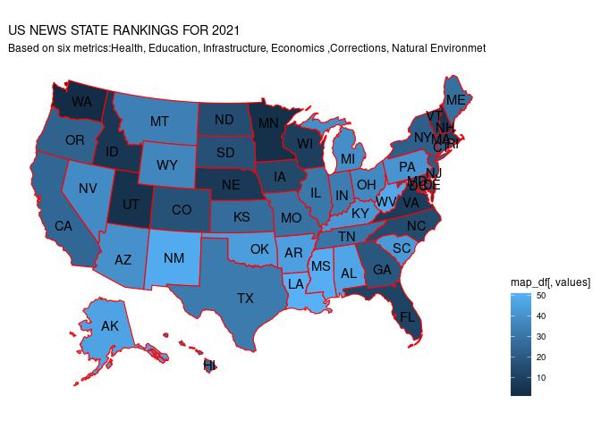

RANKING US STATES ON A YEARLY BASIS AND ON 10 YEAR AVERAGE FROM 2011 TO
2020
================
Beatrice & Moreen
3/15/2022

## R Markdown

``` r
library(tidyverse)
```

    ## ── Attaching packages ─────────────────────────────────────── tidyverse 1.3.1 ──

    ## ✓ ggplot2 3.3.4     ✓ purrr   0.3.4
    ## ✓ tibble  3.1.2     ✓ dplyr   1.0.7
    ## ✓ tidyr   1.1.3     ✓ stringr 1.4.0
    ## ✓ readr   1.4.0     ✓ forcats 0.5.1

    ## ── Conflicts ────────────────────────────────────────── tidyverse_conflicts() ──
    ## x dplyr::filter() masks stats::filter()
    ## x dplyr::lag()    masks stats::lag()

This is an R Markdown document. Markdown is a simple formatting syntax
for authoring HTML, PDF, and MS Word documents. For more details on
using R Markdown see <http://rmarkdown.rstudio.com>.

When you click the **Knit** button a document will be generated that
includes both content as well as the output of any embedded R code
chunks within the document. You can embed an R code chunk like this:

## R loading data on infrastructure:

## metric Road quality

``` r
road_quality_data <- read_csv("road_quality_data.csv")
```

    ## 
    ## ── Column specification ────────────────────────────────────────────────────────
    ## cols(
    ##   Year = col_double(),
    ##   Class = col_character(),
    ##   System = col_character(),
    ##   `International Roughness Index` = col_logical(),
    ##   State = col_character(),
    ##   `Pivot Field Names` = col_character(),
    ##   Value = col_double()
    ## )

    ## Warning: 6 parsing failures.
    ##  row                           col           expected                        actual                    file
    ## 1405 Year                          a double           Year                          'road_quality_data.csv'
    ## 1405 International Roughness Index 1/0/T/F/TRUE/FALSE International Roughness Index 'road_quality_data.csv'
    ## 1405 Value                         a double           Value                         'road_quality_data.csv'
    ## 2054 Year                          a double           Year                          'road_quality_data.csv'
    ## 2054 International Roughness Index 1/0/T/F/TRUE/FALSE International Roughness Index 'road_quality_data.csv'
    ## .... ............................. .................. ............................. .......................
    ## See problems(...) for more details.

``` r
road_quality_data
```

    ## # A tibble: 2,756 x 7
    ##     Year Class     System  `International Rough… State  `Pivot Field Na…   Value
    ##    <dbl> <chr>     <chr>   <lgl>                 <chr>  <chr>              <dbl>
    ##  1  2020 Acceptab… Overall NA                    Alaba… Acceptable       2.35e+4
    ##  2  2020 Percent … Overall NA                    Alaba… Percent Accepta… 9.09e-1
    ##  3  2020 Total (m… Overall NA                    Alaba… Total            2.59e+4
    ##  4  2019 Acceptab… Overall NA                    Alaba… Acceptable       2.32e+4
    ##  5  2019 Percent … Overall NA                    Alaba… Percent Accepta… 8.87e-1
    ##  6  2019 Total (m… Overall NA                    Alaba… Total            2.62e+4
    ##  7  2018 Acceptab… Overall NA                    Alaba… Acceptable       2.29e+4
    ##  8  2018 Percent … Overall NA                    Alaba… Percent Accepta… 8.81e-1
    ##  9  2018 Total (m… Overall NA                    Alaba… Total            2.60e+4
    ## 10  2017 Acceptab… Overall NA                    Alaba… Acceptable       2.13e+4
    ## # … with 2,746 more rows

## filtering out unwanted rows

## renaming the states

## select the required columns

``` r
wrangled_data_roads <- road_quality_data %>% 
filter(grepl('Percent Acceptable', Class))%>%
rename(International_Roughness_Index = Value) %>%
select(Year,State,International_Roughness_Index ) 


wrangled_data_roads
```

    ## # A tibble: 918 x 3
    ##     Year State   International_Roughness_Index
    ##    <dbl> <chr>                           <dbl>
    ##  1  2020 Alabama                         0.909
    ##  2  2019 Alabama                         0.887
    ##  3  2018 Alabama                         0.881
    ##  4  2017 Alabama                         0.861
    ##  5  2016 Alabama                         0.864
    ##  6  2015 Alabama                         0.976
    ##  7  2014 Alabama                         0.901
    ##  8  2013 Alabama                         0.891
    ##  9  2012 Alabama                         0.922
    ## 10  2011 Alabama                         0.915
    ## # … with 908 more rows

# Using pivot wider to tidy the data

``` r
final_road_data1 <- wrangled_data_roads %>%
pivot_wider(names_from = Year, values_from = International_Roughness_Index)

final_road_data1
```

    ## # A tibble: 51 x 19
    ##    State   `2020` `2019` `2018` `2017` `2016` `2015` `2014` `2013` `2012` `2011`
    ##    <chr>    <dbl>  <dbl>  <dbl>  <dbl>  <dbl>  <dbl>  <dbl>  <dbl>  <dbl>  <dbl>
    ##  1 Alabama 0.909  0.887  0.881  0.861  0.864  0.976  0.901  0.891  0.922  0.915 
    ##  2 Alaska  0.809  0.830  0.769  0.775  0.767  0.789  0.767  0.793  0.790  0.760 
    ##  3 Arizona 0.775  0.791  0.814  0.803  0.858  0.852  0.878  0.921  0.932  0.854 
    ##  4 Arkans… 0.920  0.933  0.797  0.912  0.882  0.793  0.818  0.771  0.800  0.774 
    ##  5 Colora… 0.781  0.778  0.781  0.777  0.763  0.792  0.785  0.765  0.792  0.806 
    ##  6 Califo… 0.670  0.648  0.587  0.550  0.563  0.496  0.630  0.601  0.609  0.608 
    ##  7 Connec… 0.670  0.660  0.649  0.656  0.652  0.435  0.555  0.537  0.478  0.520 
    ##  8 Delawa… 0.837  0.840  0.817  0.816  0.826  0.841  0.810  0.832  0.806  0.798 
    ##  9 Distri… 0.0861 0.0724 0.0676 0.0671 0.0766 0.0463 0.0396 0.0619 0.0374 0.0315
    ## 10 Florida 0.877  0.871  0.882  0.904  0.900  0.905  0.920  0.834  0.928  0.891 
    ## # … with 41 more rows, and 8 more variables: 2010 <dbl>, 2009 <dbl>,
    ## #   2008 <dbl>, 2007 <dbl>, 2006 <dbl>, 2005 <dbl>, 2000 <dbl>, 1995 <dbl>

# replacing NA cell

``` r
final_road_data1 [22, 8] = 0.634656894
```

# Deleting unwanted columns using dplyr select

# using mutate to get the sum and average

``` r
ten_year_roadmean <- final_road_data1 %>%
select(-c(12:19)) %>%
mutate("10year_mean" =rowMeans(select(.,`2011`,`2012`,`2013`,`2014`,`2015`,`2016`,`2017`,`2018`,`2019`,`2020`)))

ten_year_roadmean
```

    ## # A tibble: 51 x 12
    ##    State   `2020` `2019` `2018` `2017` `2016` `2015` `2014` `2013` `2012` `2011`
    ##    <chr>    <dbl>  <dbl>  <dbl>  <dbl>  <dbl>  <dbl>  <dbl>  <dbl>  <dbl>  <dbl>
    ##  1 Alabama 0.909  0.887  0.881  0.861  0.864  0.976  0.901  0.891  0.922  0.915 
    ##  2 Alaska  0.809  0.830  0.769  0.775  0.767  0.789  0.767  0.793  0.790  0.760 
    ##  3 Arizona 0.775  0.791  0.814  0.803  0.858  0.852  0.878  0.921  0.932  0.854 
    ##  4 Arkans… 0.920  0.933  0.797  0.912  0.882  0.793  0.818  0.771  0.800  0.774 
    ##  5 Colora… 0.781  0.778  0.781  0.777  0.763  0.792  0.785  0.765  0.792  0.806 
    ##  6 Califo… 0.670  0.648  0.587  0.550  0.563  0.496  0.630  0.601  0.609  0.608 
    ##  7 Connec… 0.670  0.660  0.649  0.656  0.652  0.435  0.555  0.537  0.478  0.520 
    ##  8 Delawa… 0.837  0.840  0.817  0.816  0.826  0.841  0.810  0.832  0.806  0.798 
    ##  9 Distri… 0.0861 0.0724 0.0676 0.0671 0.0766 0.0463 0.0396 0.0619 0.0374 0.0315
    ## 10 Florida 0.877  0.871  0.882  0.904  0.900  0.905  0.920  0.834  0.928  0.891 
    ## # … with 41 more rows, and 1 more variable: 10year_mean <dbl>

## using mutate to get the 10yr road data mean

``` r
rankedroad_data_2011to2020 <-ten_year_roadmean %>%
arrange(desc(`10year_mean`)) %>% 
mutate('2011_ranking' =min_rank(desc(`2011`))) %>% 
mutate('2012_ranking' = min_rank(desc(`2012`) )) %>% 
mutate('2013_ranking' = min_rank(desc(`2013`)) ) %>% 
mutate('2014_ranking' = min_rank(desc(`2014`)) ) %>% 
mutate('2015_ranking' = min_rank(desc(`2015`)) ) %>% 
mutate('2016_ranking' = min_rank(desc(`2016`)) ) %>% 
mutate('2017_ranking' = min_rank(desc(`2017`)) ) %>% 
mutate('2018_ranking' = min_rank(desc(`2018`)) ) %>% 
mutate('2019_ranking' = min_rank(desc(`2019`)) ) %>% 
mutate('2020_ranking' = min_rank(desc(`2020`)) ) %>% 
mutate('10year_ranking' = min_rank(desc(`10year_mean`)) )

rankedroad_data_2011to2020 
```

    ## # A tibble: 51 x 23
    ##    State   `2020` `2019` `2018` `2017` `2016` `2015` `2014` `2013` `2012` `2011`
    ##    <chr>    <dbl>  <dbl>  <dbl>  <dbl>  <dbl>  <dbl>  <dbl>  <dbl>  <dbl>  <dbl>
    ##  1 Idaho    0.902  0.964  0.969  0.964  0.953  0.955  0.952  0.949  0.887  0.985
    ##  2 Georgia  0.928  0.929  0.968  0.952  0.965  0.964  0.887  0.867  0.995  0.995
    ##  3 Tennes…  0.946  0.947  0.946  0.953  0.936  0.916  0.941  0.926  0.952  0.953
    ##  4 North …  0.941  0.941  0.934  0.901  0.972  0.904  0.951  0.946  0.964  0.941
    ##  5 Nebras…  0.929  0.889  0.899  0.923  0.918  0.925  0.947  0.952  0.938  0.927
    ##  6 Wyoming  0.943  0.947  0.804  0.920  0.933  0.912  0.918  0.918  0.917  0.939
    ##  7 Kentuc…  0.926  0.901  0.920  0.903  0.899  0.920  0.926  0.910  0.898  0.921
    ##  8 Alabama  0.909  0.887  0.881  0.861  0.864  0.976  0.901  0.891  0.922  0.915
    ##  9 Montana  0.873  0.883  0.880  0.885  0.883  0.899  0.907  0.894  0.927  0.929
    ## 10 Oregon   0.886  0.899  0.898  0.893  0.880  0.883  0.884  0.895  0.896  0.931
    ## # … with 41 more rows, and 12 more variables: 10year_mean <dbl>,
    ## #   2011_ranking <int>, 2012_ranking <int>, 2013_ranking <int>,
    ## #   2014_ranking <int>, 2015_ranking <int>, 2016_ranking <int>,
    ## #   2017_ranking <int>, 2018_ranking <int>, 2019_ranking <int>,
    ## #   2020_ranking <int>, 10year_ranking <int>

# summary of states and their roadranks

``` r
roadrank_summary <- rankedroad_data_2011to2020  %>% 
select(State, c(`2011_ranking`:`10year_ranking`))

roadrank_summary
```

    ## # A tibble: 51 x 12
    ##    State        `2011_ranking` `2012_ranking` `2013_ranking` `2014_ranking`
    ##    <chr>                 <int>          <int>          <int>          <int>
    ##  1 Idaho                     2             19              4              1
    ##  2 Georgia                   1              1             19             14
    ##  3 Tennessee                 3              4              7              4
    ##  4 North Dakota              4              2              6              2
    ##  5 Nebraska                 10              5              3              3
    ##  6 Wyoming                   5             10             10              7
    ##  7 Kentucky                 11             14             12              5
    ##  8 Alabama                  13              9             17             12
    ##  9 Montana                   9              8             14             10
    ## 10 Oregon                    8             16             13             15
    ## # … with 41 more rows, and 7 more variables: 2015_ranking <int>,
    ## #   2016_ranking <int>, 2017_ranking <int>, 2018_ranking <int>,
    ## #   2019_ranking <int>, 2020_ranking <int>, 10year_ranking <int>

# Importing electricity data prices per state

``` r
electricity_price_state <- read_csv("state_electricity_price.csv")
```

    ## 
    ## ── Column specification ────────────────────────────────────────────────────────
    ## cols(
    ##   state = col_character(),
    ##   date = col_date(format = ""),
    ##   value = col_double()
    ## )

``` r
electricity_price_state
```

    ## # A tibble: 1,061 x 3
    ##    state   date       value
    ##    <chr>   <date>     <dbl>
    ##  1 Alabama 2001-01-01  7.01
    ##  2 Alabama 2002-01-01  7.12
    ##  3 Alabama 2003-01-01  7.39
    ##  4 Alabama 2004-01-01  7.62
    ##  5 Alabama 2005-01-01  8   
    ##  6 Alabama 2006-01-01  8.75
    ##  7 Alabama 2007-01-01  9.32
    ##  8 Alabama 2008-01-01 10.4 
    ##  9 Alabama 2009-01-01 10.7 
    ## 10 Alabama 2010-01-01 10.7 
    ## # … with 1,051 more rows

# data wrangling to clean up the data

# separating date column into year,month,day

# making the tibble wider

# splitting the date column into year, month, date

``` r
electricity_price <- electricity_price_state %>%
separate(date, into = c("year", "month","date"), sep = "-")%>%
select(-c(3:4)) %>%
pivot_wider(names_from = year, values_from = value )


   
electricity_price
```

    ## # A tibble: 51 x 22
    ##    state   `2001` `2002` `2003` `2004` `2005` `2006` `2007` `2008` `2009` `2010`
    ##    <chr>    <dbl>  <dbl>  <dbl>  <dbl>  <dbl>  <dbl>  <dbl>  <dbl>  <dbl>  <dbl>
    ##  1 Alabama   7.01   7.12   7.39   7.62   8      8.75   9.32  10.4   10.7   10.7 
    ##  2 Alaska   NA     NA     NA     NA     NA     NA     NA     NA     NA     NA   
    ##  3 Arizona   8.3    8.27   8.35   8.46   8.86   9.4    9.66  10.3   10.7   11.0 
    ##  4 Arkans…   7.72   7.25   7.24   7.36   8      8.85   8.73   9.27   9.14   8.86
    ##  5 Califo…  12.1   12.6   12.2   12.2   12.5   14.3   14.4   13.8   14.7   14.8 
    ##  6 Colora…   7.47   7.37   8.14   8.42   9.06   9.02   9.25  10.1   10     11.0 
    ##  7 Connec…  10.9   11.0   11.3   11.6   13.6   16.9   19.1   19.5   20.3   19.2 
    ##  8 Delawa…   8.61   8.7    8.59   8.78   9.01  11.8   13.2   13.9   14.1   13.8 
    ##  9 Distri…   7.79   7.98   7.84   8      9.1    9.88  11.2   12.8   13.7   14.0 
    ## 10 Florida   8.59   8.16   8.55   8.99   9.62  11.3   11.2   11.6   12.4   11.4 
    ## # … with 41 more rows, and 11 more variables: 2011 <dbl>, 2012 <dbl>,
    ## #   2013 <dbl>, 2014 <dbl>, 2015 <dbl>, 2016 <dbl>, 2017 <dbl>, 2018 <dbl>,
    ## #   2019 <dbl>, 2020 <dbl>, 2021 <dbl>

# deleting unwanted rows

``` r
final_electricity_price1 <- electricity_price %>%
select(-c(2:11, 22)) 

final_electricity_price1
```

    ## # A tibble: 51 x 11
    ##    state   `2011` `2012` `2013` `2014` `2015` `2016` `2017` `2018` `2019` `2020`
    ##    <chr>    <dbl>  <dbl>  <dbl>  <dbl>  <dbl>  <dbl>  <dbl>  <dbl>  <dbl>  <dbl>
    ##  1 Alabama  11.1    11.4  11.3   11.5   11.7   12.0    12.6  12.2    12.5   12.6
    ##  2 Alaska   17.6    17.9  18.1   19.1   19.8   20.3    21.3  21.9    22.9   22.6
    ##  3 Arizona  11.1    11.3  11.7   11.9   12.1   12.2    12.4  12.8    12.4   12.3
    ##  4 Arkans…   9.02    9.3   9.59   9.51   9.82   9.92   10.3   9.81    9.8   10.4
    ##  5 Califo…  14.8    15.3  16.2   16.2   17.0   17.4    18.3  18.8    19.2   20.4
    ##  6 Colora…  11.3    11.5  11.9   12.2   12.1   12.1    12.2  12.2    12.2   12.4
    ##  7 Connec…  18.1    17.3  17.6   19.8   20.9   20.0    20.3  21.2    21.9   22.7
    ##  8 Delawa…  13.7    13.6  13.0   13.3   13.4   13.4    13.4  12.5    12.6   12.6
    ##  9 Distri…  13.4    12.3  12.6   12.7   13.0   12.3    12.9  12.8    13.0   12.6
    ## 10 Florida  11.5    11.4  11.3   11.9   11.6   11.0    11.6  11.5    11.7   11.3
    ## # … with 41 more rows

``` r
elec_tenyear_mean <- final_electricity_price1 %>%
mutate("10year_mean" =rowMeans(select(.,`2011`,`2012`,`2013`,`2014`,`2015`,`2016`,`2017`,`2018`,`2019`,`2020`)))

elec_tenyear_mean
```

    ## # A tibble: 51 x 12
    ##    state   `2011` `2012` `2013` `2014` `2015` `2016` `2017` `2018` `2019` `2020`
    ##    <chr>    <dbl>  <dbl>  <dbl>  <dbl>  <dbl>  <dbl>  <dbl>  <dbl>  <dbl>  <dbl>
    ##  1 Alabama  11.1    11.4  11.3   11.5   11.7   12.0    12.6  12.2    12.5   12.6
    ##  2 Alaska   17.6    17.9  18.1   19.1   19.8   20.3    21.3  21.9    22.9   22.6
    ##  3 Arizona  11.1    11.3  11.7   11.9   12.1   12.2    12.4  12.8    12.4   12.3
    ##  4 Arkans…   9.02    9.3   9.59   9.51   9.82   9.92   10.3   9.81    9.8   10.4
    ##  5 Califo…  14.8    15.3  16.2   16.2   17.0   17.4    18.3  18.8    19.2   20.4
    ##  6 Colora…  11.3    11.5  11.9   12.2   12.1   12.1    12.2  12.2    12.2   12.4
    ##  7 Connec…  18.1    17.3  17.6   19.8   20.9   20.0    20.3  21.2    21.9   22.7
    ##  8 Delawa…  13.7    13.6  13.0   13.3   13.4   13.4    13.4  12.5    12.6   12.6
    ##  9 Distri…  13.4    12.3  12.6   12.7   13.0   12.3    12.9  12.8    13.0   12.6
    ## 10 Florida  11.5    11.4  11.3   11.9   11.6   11.0    11.6  11.5    11.7   11.3
    ## # … with 41 more rows, and 1 more variable: 10year_mean <dbl>

``` r
elec_meandata_2011to2020 <- elec_tenyear_mean %>%
arrange((`10year_mean`)) %>% 
mutate('2011_ranking' =min_rank((`2011`))) %>% 
mutate('2012_ranking' = min_rank((`2012`) )) %>% 
mutate('2013_ranking' = min_rank((`2013`)) ) %>% 
mutate('2014_ranking' = min_rank((`2014`)) ) %>% 
mutate('2015_ranking' = min_rank((`2015`)) ) %>% 
mutate('2016_ranking' = min_rank((`2016`)) ) %>% 
mutate('2017_ranking' = min_rank((`2017`)) ) %>% 
mutate('2018_ranking' = min_rank((`2018`)) ) %>% 
mutate('2019_ranking' = min_rank((`2019`)) ) %>% 
mutate('2020_ranking' = min_rank((`2020`)) ) %>% 
mutate('10year_ranking' = min_rank((`10year_mean`)) )

elec_meandata_2011to2020
```

    ## # A tibble: 51 x 23
    ##    state   `2011` `2012` `2013` `2014` `2015` `2016` `2017` `2018` `2019` `2020`
    ##    <chr>    <dbl>  <dbl>  <dbl>  <dbl>  <dbl>  <dbl>  <dbl>  <dbl>  <dbl>  <dbl>
    ##  1 Washin…   8.28   8.53   8.7    8.67   9.09   9.48   9.66   9.75   9.71   9.87
    ##  2 Louisi…   8.96   8.37   9.43   9.57   9.33   9.34   9.74   9.59   9.8    9.67
    ##  3 Idaho     7.87   8.67   9.32   9.72   9.93   9.95  10.0   10.2    9.89   9.95
    ##  4 North …   8.58   9.06   9.12   9.15   9.62  10.2   10.3   10.2   10.3   10.4 
    ##  5 Arkans…   9.02   9.3    9.59   9.51   9.82   9.92  10.3    9.81   9.8   10.4 
    ##  6 Oklaho…   9.47   9.51   9.67  10.0   10.1   10.2   10.6   10.3   10.2   10.1 
    ##  7 Kentuc…   9.2    9.43   9.79  10.2   10.2   10.5   10.8   10.6   10.8   10.9 
    ##  8 Utah      8.96   9.93  10.4   10.6   10.9   11.0   11.0   10.4   10.4   10.4 
    ##  9 Tennes…   9.98  10.1    9.98  10.3   10.3   10.4   10.7   10.7   10.9   10.8 
    ## 10 Nebras…   9.32  10.0   10.3   10.4   10.6   10.8   11.0   10.7   10.8   10.8 
    ## # … with 41 more rows, and 12 more variables: 10year_mean <dbl>,
    ## #   2011_ranking <int>, 2012_ranking <int>, 2013_ranking <int>,
    ## #   2014_ranking <int>, 2015_ranking <int>, 2016_ranking <int>,
    ## #   2017_ranking <int>, 2018_ranking <int>, 2019_ranking <int>,
    ## #   2020_ranking <int>, 10year_ranking <int>

# summary of state and electricity price rankings 2011-2020

``` r
elecprice_rank <- elec_meandata_2011to2020 %>% 
select(state, c(`2011_ranking`:`10year_ranking`))

elecprice_rank
```

    ## # A tibble: 51 x 12
    ##    state        `2011_ranking` `2012_ranking` `2013_ranking` `2014_ranking`
    ##    <chr>                 <int>          <int>          <int>          <int>
    ##  1 Washington                2              2              1              1
    ##  2 Louisiana                 4              1              4              5
    ##  3 Idaho                     1              3              3              6
    ##  4 North Dakota              3              4              2              2
    ##  5 Arkansas                  6              5              6              4
    ##  6 Oklahoma                 12              7              7              7
    ##  7 Kentucky                  8              6              8              8
    ##  8 Utah                      4             11             15             16
    ##  9 Tennessee                16             15             10             10
    ## 10 Nebraska                  9             12             13             11
    ## # … with 41 more rows, and 7 more variables: 2015_ranking <int>,
    ## #   2016_ranking <int>, 2017_ranking <int>, 2018_ranking <int>,
    ## #   2019_ranking <int>, 2020_ranking <int>, 10year_ranking <int>

# loading Crime rate data

``` r
Corrections_data <- read_csv("Corrections data.csv")
```

    ## Warning: Missing column names filled in: 'X2' [2], 'X3' [3], 'X4' [4], 'X5' [5],
    ## 'X6' [6], 'X7' [7], 'X8' [8], 'X9' [9], 'X10' [10], 'X11' [11], 'X12' [12],
    ## 'X13' [13], 'X14' [14], 'X15' [15], 'X16' [16], 'X17' [17], 'X18' [18],
    ## 'X19' [19], 'X20' [20], 'X21' [21], 'X22' [22], 'X23' [23], 'X24' [24],
    ## 'X25' [25], 'X26' [26], 'X27' [27], 'X28' [28], 'X29' [29], 'X30' [30],
    ## 'X31' [31], 'X32' [32], 'X33' [33], 'X34' [34], 'X35' [35], 'X36' [36],
    ## 'X37' [37], 'X38' [38], 'X39' [39], 'X40' [40], 'X41' [41], 'X42' [42],
    ## 'X43' [43], 'X44' [44]

    ## 
    ## ── Column specification ────────────────────────────────────────────────────────
    ## cols(
    ##   .default = col_double(),
    ##   `Bureau of Justice Statistics (www.bjs.gov)` = col_character(),
    ##   X2 = col_logical(),
    ##   X3 = col_character(),
    ##   X4 = col_character(),
    ##   X5 = col_character(),
    ##   X6 = col_character(),
    ##   X7 = col_character(),
    ##   X8 = col_character(),
    ##   X9 = col_character(),
    ##   X10 = col_character(),
    ##   X11 = col_character(),
    ##   X12 = col_character(),
    ##   X13 = col_character(),
    ##   X14 = col_character(),
    ##   X15 = col_character(),
    ##   X16 = col_character()
    ## )
    ## ℹ Use `spec()` for the full column specifications.

``` r
Corrections_data
```

    ## # A tibble: 742 x 44
    ##    `Bureau of Justi… X2    X3    X4    X5    X6    X7    X8    X9    X10   X11  
    ##    <chr>             <lgl> <chr> <chr> <chr> <chr> <chr> <chr> <chr> <chr> <chr>
    ##  1 Tool Title: Corr… NA    <NA>  <NA>  <NA>  <NA>  <NA>  <NA>  <NA>  <NA>  <NA> 
    ##  2 Data source: Nat… NA    <NA>  <NA>  <NA>  <NA>  <NA>  <NA>  <NA>  <NA>  <NA> 
    ##  3 Refer questions … NA    <NA>  <NA>  <NA>  <NA>  <NA>  <NA>  <NA>  <NA>  <NA> 
    ##  4 <NA>              NA    <NA>  <NA>  <NA>  <NA>  <NA>  <NA>  <NA>  <NA>  <NA> 
    ##  5 <NA>              NA    <NA>  <NA>  <NA>  <NA>  <NA>  <NA>  <NA>  <NA>  <NA> 
    ##  6 Count of total j… NA    <NA>  <NA>  <NA>  <NA>  <NA>  <NA>  <NA>  <NA>  <NA> 
    ##  7 <NA>              NA    <NA>  <NA>  <NA>  <NA>  <NA>  <NA>  <NA>  <NA>  <NA> 
    ##  8 Jurisdiction      NA    1978… 1979… 1980… 1981… 1982… 1983… 1984… 1985… 1986…
    ##  9 National Statist… NA    3072… 3144… 3298… 3699… 4138… 4368… 4620… 5025… 5449…
    ## 10 Federal Institut… NA    29803 26371 24363 28133 29673 31926 34263 40223 44408
    ## # … with 732 more rows, and 33 more variables: X12 <chr>, X13 <chr>, X14 <chr>,
    ## #   X15 <chr>, X16 <chr>, X17 <dbl>, X18 <dbl>, X19 <dbl>, X20 <dbl>,
    ## #   X21 <dbl>, X22 <dbl>, X23 <dbl>, X24 <dbl>, X25 <dbl>, X26 <dbl>,
    ## #   X27 <dbl>, X28 <dbl>, X29 <dbl>, X30 <dbl>, X31 <dbl>, X32 <dbl>,
    ## #   X33 <dbl>, X34 <dbl>, X35 <dbl>, X36 <dbl>, X37 <dbl>, X38 <dbl>,
    ## #   X39 <dbl>, X40 <dbl>, X41 <dbl>, X42 <dbl>, X43 <dbl>, X44 <dbl>

``` r
data_correction <- Corrections_data %>%
slice(-c(1:7)) 


data_correction
```

    ## # A tibble: 735 x 44
    ##    `Bureau of Justi… X2    X3    X4    X5    X6    X7    X8    X9    X10   X11  
    ##    <chr>             <lgl> <chr> <chr> <chr> <chr> <chr> <chr> <chr> <chr> <chr>
    ##  1 Jurisdiction      NA    1978… 1979… 1980… 1981… 1982… 1983… 1984… 1985… 1986…
    ##  2 National Statist… NA    3072… 3144… 3298… 3699… 4138… 4368… 4620… 5025… 5449…
    ##  3 Federal Institut… NA    29803 26371 24363 28133 29673 31926 34263 40223 44408
    ##  4 State Institutio… NA    2774… 2880… 3054… 3417… 3841… 4049… 4277… 4622… 5005…
    ##  5 Alabama/33/34/35… NA    5625  5464  6543  7657  9233  9856  10482 11015 11710
    ##  6 Alaska/38/39/40/… NA    712   760   822   1024  1322  1631  1967  2329  2460 
    ##  7 Arizona/60/61/62… NA    3456  3749  4372  5223  6069  6889  7845  8531  9434 
    ##  8 Arkansas/82/83/8… NA    2654  3042  2911  3328  3922  4246  4482  4611  4701 
    ##  9 California/66/91… NA    21325 22632 24569 29202 34640 39373 43197 50158 59484
    ## 10 Colorado/100/101… NA    2486  2668  2629  2772  3042  3244  3231  3386  3804 
    ## # … with 725 more rows, and 33 more variables: X12 <chr>, X13 <chr>, X14 <chr>,
    ## #   X15 <chr>, X16 <chr>, X17 <dbl>, X18 <dbl>, X19 <dbl>, X20 <dbl>,
    ## #   X21 <dbl>, X22 <dbl>, X23 <dbl>, X24 <dbl>, X25 <dbl>, X26 <dbl>,
    ## #   X27 <dbl>, X28 <dbl>, X29 <dbl>, X30 <dbl>, X31 <dbl>, X32 <dbl>,
    ## #   X33 <dbl>, X34 <dbl>, X35 <dbl>, X36 <dbl>, X37 <dbl>, X38 <dbl>,
    ## #   X39 <dbl>, X40 <dbl>, X41 <dbl>, X42 <dbl>, X43 <dbl>, X44 <dbl>

# continuing data deletion

# Rename the name of coloumn 1

# Separate coloumn 1

# using the first row as the header

``` r
data_correction2 <- data_correction %>%
slice(-c(56:735)) %>%
slice(-c(2:4)) %>%
rename(State = 1) %>%
separate(State, into = "States", sep = "/", extra = 'drop') %>%
select (-c(2:35)) %>%
purrr::set_names(as.character(slice(., 1))) %>%
slice(-1)


data_correction2
```

    ## # A tibble: 51 x 10
    ##    Jurisdiction   `2011` `2012` `2013` `2014` `2015` `2016` `2017` `2018` `2019`
    ##    <chr>           <dbl>  <dbl>  <dbl>  <dbl>  <dbl>  <dbl>  <dbl>  <dbl>  <dbl>
    ##  1 Alabama         32270  32431  32381  31771  30810  28883  27608  26841  28304
    ##  2 Alaska           5597   5633   5081   5794   5338   4434   4399   4380   4475
    ##  3 Arizona         40020  40080  41177  42259  42719  42320  42030  42005  42441
    ##  4 Arkansas        16108  14654  17235  17874  17707  17537  18070  17799  17759
    ##  5 California     149569 134534 135981 136085 129593 130084 131039 128625 122687
    ##  6 Colorado        21978  20462  20371  20646  20041  19981  19946  20372  19785
    ##  7 Connecticut     18324  17530  17563  16636  15816  14957  14040  13681  12823
    ##  8 Delaware         6739   6914   7004   6955   6654   6585   6443   6067   5692
    ##  9 District of C…      0      0      0      0      0      0      0      0      0
    ## 10 Florida        103055 101930 103028 102870 101424  99974  98504  97538  96009
    ## # … with 41 more rows

``` r
final_data_correction <- data_correction2 %>%
rename(State = 1)


final_data_correction
```

    ## # A tibble: 51 x 10
    ##    State          `2011` `2012` `2013` `2014` `2015` `2016` `2017` `2018` `2019`
    ##    <chr>           <dbl>  <dbl>  <dbl>  <dbl>  <dbl>  <dbl>  <dbl>  <dbl>  <dbl>
    ##  1 Alabama         32270  32431  32381  31771  30810  28883  27608  26841  28304
    ##  2 Alaska           5597   5633   5081   5794   5338   4434   4399   4380   4475
    ##  3 Arizona         40020  40080  41177  42259  42719  42320  42030  42005  42441
    ##  4 Arkansas        16108  14654  17235  17874  17707  17537  18070  17799  17759
    ##  5 California     149569 134534 135981 136085 129593 130084 131039 128625 122687
    ##  6 Colorado        21978  20462  20371  20646  20041  19981  19946  20372  19785
    ##  7 Connecticut     18324  17530  17563  16636  15816  14957  14040  13681  12823
    ##  8 Delaware         6739   6914   7004   6955   6654   6585   6443   6067   5692
    ##  9 District of C…      0      0      0      0      0      0      0      0      0
    ## 10 Florida        103055 101930 103028 102870 101424  99974  98504  97538  96009
    ## # … with 41 more rows

## loading data on population

``` r
population <- read_csv("Statespopulation_2011to2020.csv") 
```

    ## 
    ## ── Column specification ────────────────────────────────────────────────────────
    ## cols(
    ##   States = col_character(),
    ##   `2011` = col_double(),
    ##   `2012` = col_double(),
    ##   `2013` = col_double(),
    ##   `2014` = col_double(),
    ##   `2015` = col_double(),
    ##   `2016` = col_double(),
    ##   `2017` = col_double(),
    ##   `2018` = col_double(),
    ##   `2019` = col_double(),
    ##   `2020` = col_double()
    ## )

    ## Warning: 3 parsing failures.
    ## row col   expected    actual                              file
    ##  83  -- 11 columns 1 columns 'Statespopulation_2011to2020.csv'
    ##  96  -- 11 columns 1 columns 'Statespopulation_2011to2020.csv'
    ## 109  -- 11 columns 1 columns 'Statespopulation_2011to2020.csv'

``` r
population
```

    ## # A tibble: 114 x 11
    ##    States  `2011` `2012` `2013` `2014` `2015` `2016` `2017` `2018` `2019` `2020`
    ##    <chr>    <dbl>  <dbl>  <dbl>  <dbl>  <dbl>  <dbl>  <dbl>  <dbl>  <dbl>  <dbl>
    ##  1 Alabama 4.68e6 4.70e6 4.71e6 4.71e6 4.73e6 4.83e6 4.74e6 4.86e6 4.77e6 4.89e6
    ##  2 Alaska  6.97e5 7.06e5 7.05e5 7.07e5 7.08e5 7.08e5 7.10e5 7.21e5 7.02e5 7.06e5
    ##  3 Arizona 6.32e6 6.39e6 6.47e6 6.56e6 6.66e6 6.88e6 6.84e6 7.23e6 7.10e6 7.47e6
    ##  4 Arkans… 2.85e6 2.86e6 2.87e6 2.88e6 2.88e6 2.94e6 2.91e6 2.91e6 2.92e6 2.98e6
    ##  5 Califo… 3.69e7 3.72e7 3.75e7 3.80e7 3.83e7 3.91e7 3.87e7 3.91e7 3.86e7 3.91e7
    ##  6 Colora… 4.98e6 5.05e6 5.13e6 5.22e6 5.32e6 5.50e6 5.46e6 5.73e6 5.61e6 5.74e6
    ##  7 Connec… 3.47e6 3.48e6 3.48e6 3.48e6 3.48e6 3.57e6 3.48e6 3.42e6 3.45e6 3.48e6
    ##  8 Delawa… 8.80e5 8.88e5 8.98e5 9.05e5 9.18e5 9.44e5 9.32e5 9.74e5 9.40e5 9.82e5
    ##  9 Distri… 5.84e5 5.96e5 6.10e5 6.24e5 6.35e5 6.84e5 6.58e5 6.91e5 6.71e5 7.17e5
    ## 10 Florida 1.86e7 1.89e7 1.91e7 1.94e7 1.98e7 2.05e7 2.05e7 2.11e7 2.10e7 2.17e7
    ## # … with 104 more rows

# rename column 1

``` r
renamed_population <- population %>%
rename(State = 1) %>%
slice(1:51)%>%
select(-c(11))

renamed_population
```

    ## # A tibble: 51 x 10
    ##    State       `2011`  `2012`  `2013`  `2014` `2015` `2016` `2017` `2018` `2019`
    ##    <chr>        <dbl>   <dbl>   <dbl>   <dbl>  <dbl>  <dbl>  <dbl>  <dbl>  <dbl>
    ##  1 Alabama     4.68e6  4.70e6  4.71e6  4.71e6 4.73e6 4.83e6 4.74e6 4.86e6 4.77e6
    ##  2 Alaska      6.97e5  7.06e5  7.05e5  7.07e5 7.08e5 7.08e5 7.10e5 7.21e5 7.02e5
    ##  3 Arizona     6.32e6  6.39e6  6.47e6  6.56e6 6.66e6 6.88e6 6.84e6 7.23e6 7.10e6
    ##  4 Arkansas    2.85e6  2.86e6  2.87e6  2.88e6 2.88e6 2.94e6 2.91e6 2.91e6 2.92e6
    ##  5 California  3.69e7  3.72e7  3.75e7  3.80e7 3.83e7 3.91e7 3.87e7 3.91e7 3.86e7
    ##  6 Colorado    4.98e6  5.05e6  5.13e6  5.22e6 5.32e6 5.50e6 5.46e6 5.73e6 5.61e6
    ##  7 Connectic…  3.47e6  3.48e6  3.48e6  3.48e6 3.48e6 3.57e6 3.48e6 3.42e6 3.45e6
    ##  8 Delaware    8.80e5  8.88e5  8.98e5  9.05e5 9.18e5 9.44e5 9.32e5 9.74e5 9.40e5
    ##  9 District …  5.84e5  5.96e5  6.10e5  6.24e5 6.35e5 6.84e5 6.58e5 6.91e5 6.71e5
    ## 10 Florida     1.86e7  1.89e7  1.91e7  1.94e7 1.98e7 2.05e7 2.05e7 2.11e7 2.10e7
    ## # … with 41 more rows

# left join population data and correction data

``` r
combined_correction <- left_join(x = final_data_correction, y = renamed_population, by = "State" )

combined_correction
```

    ## # A tibble: 51 x 19
    ##    State `2011.x` `2012.x` `2013.x` `2014.x` `2015.x` `2016.x` `2017.x` `2018.x`
    ##    <chr>    <dbl>    <dbl>    <dbl>    <dbl>    <dbl>    <dbl>    <dbl>    <dbl>
    ##  1 Alab…    32270    32431    32381    31771    30810    28883    27608    26841
    ##  2 Alas…     5597     5633     5081     5794     5338     4434     4399     4380
    ##  3 Ariz…    40020    40080    41177    42259    42719    42320    42030    42005
    ##  4 Arka…    16108    14654    17235    17874    17707    17537    18070    17799
    ##  5 Cali…   149569   134534   135981   136085   129593   130084   131039   128625
    ##  6 Colo…    21978    20462    20371    20646    20041    19981    19946    20372
    ##  7 Conn…    18324    17530    17563    16636    15816    14957    14040    13681
    ##  8 Dela…     6739     6914     7004     6955     6654     6585     6443     6067
    ##  9 Dist…        0        0        0        0        0        0        0        0
    ## 10 Flor…   103055   101930   103028   102870   101424    99974    98504    97538
    ## # … with 41 more rows, and 10 more variables: 2019.x <dbl>, 2011.y <dbl>,
    ## #   2012.y <dbl>, 2013.y <dbl>, 2014.y <dbl>, 2015.y <dbl>, 2016.y <dbl>,
    ## #   2017.y <dbl>, 2018.y <dbl>, 2019.y <dbl>

# deleting unwanted columns in the combined data

# getting the corrections per population by dividing the two per year

``` r
data_combined_correction <- combined_correction %>%
mutate(correction_2011 = `2011.x`/`2011.y`,
       correction_2012 = `2012.x` /`2012.y`,
       correction_2013 = `2013.x`/`2013.y`,
       correction_2014 = `2014.x` /`2014.y`,
       correction_2015 = `2015.x`/`2015.y`,
       correction_2016 = `2016.x` /`2016.y`,
       correction_2017 = `2017.x`/`2017.y`,
       correction_2018 = `2018.x`/`2018.y`,
       correction_2019 = `2019.x` /`2019.y`
)
       
data_combined_correction      
```

    ## # A tibble: 51 x 28
    ##    State `2011.x` `2012.x` `2013.x` `2014.x` `2015.x` `2016.x` `2017.x` `2018.x`
    ##    <chr>    <dbl>    <dbl>    <dbl>    <dbl>    <dbl>    <dbl>    <dbl>    <dbl>
    ##  1 Alab…    32270    32431    32381    31771    30810    28883    27608    26841
    ##  2 Alas…     5597     5633     5081     5794     5338     4434     4399     4380
    ##  3 Ariz…    40020    40080    41177    42259    42719    42320    42030    42005
    ##  4 Arka…    16108    14654    17235    17874    17707    17537    18070    17799
    ##  5 Cali…   149569   134534   135981   136085   129593   130084   131039   128625
    ##  6 Colo…    21978    20462    20371    20646    20041    19981    19946    20372
    ##  7 Conn…    18324    17530    17563    16636    15816    14957    14040    13681
    ##  8 Dela…     6739     6914     7004     6955     6654     6585     6443     6067
    ##  9 Dist…        0        0        0        0        0        0        0        0
    ## 10 Flor…   103055   101930   103028   102870   101424    99974    98504    97538
    ## # … with 41 more rows, and 19 more variables: 2019.x <dbl>, 2011.y <dbl>,
    ## #   2012.y <dbl>, 2013.y <dbl>, 2014.y <dbl>, 2015.y <dbl>, 2016.y <dbl>,
    ## #   2017.y <dbl>, 2018.y <dbl>, 2019.y <dbl>, correction_2011 <dbl>,
    ## #   correction_2012 <dbl>, correction_2013 <dbl>, correction_2014 <dbl>,
    ## #   correction_2015 <dbl>, correction_2016 <dbl>, correction_2017 <dbl>,
    ## #   correction_2018 <dbl>, correction_2019 <dbl>

# selecting the correction rate per state

# using mutate to get the 10 year mean value

``` r
combined_correction_data <- data_combined_correction %>%
select(State,correction_2011:correction_2019) %>%
mutate("10year_mean" =rowMeans(select(.,`correction_2011`,`correction_2012`,`correction_2013`,`correction_2014`,`correction_2015`,`correction_2016`,`correction_2017`,`correction_2018`,`correction_2019`)))

combined_correction_data
```

    ## # A tibble: 51 x 11
    ##    State         correction_2011 correction_2012 correction_2013 correction_2014
    ##    <chr>                   <dbl>           <dbl>           <dbl>           <dbl>
    ##  1 Alabama               0.00690         0.00691         0.00688         0.00674
    ##  2 Alaska                0.00803         0.00798         0.00721         0.00820
    ##  3 Arizona               0.00633         0.00628         0.00637         0.00645
    ##  4 Arkansas              0.00565         0.00512         0.00601         0.00621
    ##  5 California            0.00406         0.00361         0.00363         0.00358
    ##  6 Colorado              0.00441         0.00406         0.00397         0.00396
    ##  7 Connecticut           0.00529         0.00504         0.00505         0.00478
    ##  8 Delaware              0.00766         0.00779         0.00780         0.00768
    ##  9 District of …         0               0               0               0      
    ## 10 Florida               0.00554         0.00540         0.00540         0.00529
    ## # … with 41 more rows, and 6 more variables: correction_2015 <dbl>,
    ## #   correction_2016 <dbl>, correction_2017 <dbl>, correction_2018 <dbl>,
    ## #   correction_2019 <dbl>, 10year_mean <dbl>

# ranked correction data

``` r
ranked_correction_data <- combined_correction_data %>%
arrange(desc(`10year_mean`)) %>% 
mutate('2011_ranking' =min_rank((`correction_2011`))) %>% 
mutate('2012_ranking' = min_rank((`correction_2012`) )) %>% 
mutate('2013_ranking' = min_rank((`correction_2013`)) ) %>% 
mutate('2014_ranking' = min_rank((`correction_2014`)) ) %>% 
mutate('2015_ranking' = min_rank((`correction_2015`)) ) %>% 
mutate('2016_ranking' = min_rank((`correction_2016`)) ) %>% 
mutate('2017_ranking' = min_rank((`correction_2017`)) ) %>% 
mutate('2018_ranking' = min_rank((`correction_2018`)) ) %>% 
mutate('2019_ranking' = min_rank((`correction_2019`)) ) %>% 
mutate('10year_ranking' = min_rank((`10year_mean`)) )

ranked_correction_data
```

    ## # A tibble: 51 x 21
    ##    State       correction_2011 correction_2012 correction_2013 correction_2014
    ##    <chr>                 <dbl>           <dbl>           <dbl>           <dbl>
    ##  1 Louisiana           0.00896         0.00901         0.00877         0.00844
    ##  2 Oklahoma            0.00709         0.00684         0.00739         0.00737
    ##  3 Delaware            0.00766         0.00779         0.00780         0.00768
    ##  4 Alaska              0.00803         0.00798         0.00721         0.00820
    ##  5 Mississippi         0.00743         0.00774         0.00760         0.00651
    ##  6 Alabama             0.00690         0.00691         0.00688         0.00674
    ##  7 Arizona             0.00633         0.00628         0.00637         0.00645
    ##  8 Texas               0.00689         0.00655         0.00653         0.00632
    ##  9 Arkansas            0.00565         0.00512         0.00601         0.00621
    ## 10 Georgia             0.00588         0.00577         0.00557         0.00541
    ## # … with 41 more rows, and 16 more variables: correction_2015 <dbl>,
    ## #   correction_2016 <dbl>, correction_2017 <dbl>, correction_2018 <dbl>,
    ## #   correction_2019 <dbl>, 10year_mean <dbl>, 2011_ranking <int>,
    ## #   2012_ranking <int>, 2013_ranking <int>, 2014_ranking <int>,
    ## #   2015_ranking <int>, 2016_ranking <int>, 2017_ranking <int>,
    ## #   2018_ranking <int>, 2019_ranking <int>, 10year_ranking <int>

# ranked correction data

``` r
final_ranked_correction <- ranked_correction_data %>%
select(State, 12:21)

final_ranked_correction
```

    ## # A tibble: 51 x 11
    ##    State       `2011_ranking` `2012_ranking` `2013_ranking` `2014_ranking`
    ##    <chr>                <int>          <int>          <int>          <int>
    ##  1 Louisiana               51             51             51             51
    ##  2 Oklahoma                47             46             48             48
    ##  3 Delaware                49             49             50             49
    ##  4 Alaska                  50             50             47             50
    ##  5 Mississippi             48             48             49             46
    ##  6 Alabama                 46             47             46             47
    ##  7 Arizona                 44             44             44             45
    ##  8 Texas                   45             45             45             44
    ##  9 Arkansas                42             39             43             43
    ## 10 Georgia                 43             43             42             41
    ## # … with 41 more rows, and 6 more variables: 2015_ranking <int>,
    ## #   2016_ranking <int>, 2017_ranking <int>, 2018_ranking <int>,
    ## #   2019_ranking <int>, 10year_ranking <int>

\# Final ranked correction data \# renaming columns

``` r
final_ranked_correction2 <- final_ranked_correction %>%
rename("2011_corrank" = 2)%>%
rename("2012_corrank" = 3)%>%
rename("2013_corrank" = 4)%>%
rename("2014_corrank" = 5)%>%
rename("2015_corrank" = 6)%>%
rename("2016_corrank" = 7)%>%
rename("2017_corrank" = 8)%>%
rename("2018_corrank" = 9)%>%
rename("2019_corrank" = 10)%>%
rename("10yr_corrank" = 11)
```

# EDUCATION DATA: college graduation

\#load data

``` r
college_graduationrate_data <- read_csv("College_Graduation_Rate_perstate.csv")
```

    ## 
    ## ── Column specification ────────────────────────────────────────────────────────
    ## cols(
    ##   States = col_character(),
    ##   `2020` = col_double(),
    ##   `2019` = col_double(),
    ##   `2018` = col_double(),
    ##   `2017` = col_character(),
    ##   `2016` = col_character(),
    ##   `2015` = col_character(),
    ##   `2014` = col_character(),
    ##   `2013` = col_character(),
    ##   `2012` = col_character(),
    ##   `2011` = col_character()
    ## )

``` r
col_conv <- c(5:11)  
college_graduationrate_data[ , col_conv] <- lapply(college_graduationrate_data[ , col_conv],function(x){ as.numeric(as.character(gsub("%", "", x))) })

college_graduationrate_data
```

    ## # A tibble: 51 x 11
    ##    States  `2020` `2019` `2018` `2017` `2016` `2015` `2014` `2013` `2012` `2011`
    ##    <chr>    <dbl>  <dbl>  <dbl>  <dbl>  <dbl>  <dbl>  <dbl>  <dbl>  <dbl>  <dbl>
    ##  1 Alabama   27.8   26.3   25.5   27.2   26.5   25.2   24.3   22.3   21.3   18  
    ##  2 Alaska    31.9   30.2   30.2   75.3   70.7   70.7   66.4   67.2   68.2   72.4
    ##  3 Arizona   33     30.2   29.7   31.7   32.4   32.1   32.6   33.4   32.9   30.8
    ##  4 Arkans…   24.9   23.3   23.3   33     33.4   29.5   28.7   27.7   25.4   23.9
    ##  5 Califo…   36.9   35     34.2   39.4   38.5   37.4   38.3   38.7   38.8   39.9
    ##  6 Colora…   44.2   42.7   41.7   56.4   61.9   54.8   49.7   48.2   44.7   43.5
    ##  7 Connec…   42.4   39.8   39.6   29.1   24.8   23.9   22     16.8   15.2   15  
    ##  8 Delawa…   34.7   33.2   31.3   44.2   58.4   63.9   59     71.3   16.1   16.4
    ##  9 Distri…   63.6   59.7   60.4   68.9   73.8   73     59.1   61.6   66.7   82.4
    ## 10 Florida   33.7   30.7   30.4   56.7   56.8   60.6   60.3   59.4   54.2   54.5
    ## # … with 41 more rows

# Ranking the average graduation rate over the years

# using lapply to change character columns to numeric

``` r
#graduation_rate2[,2:10] <- lapply(graduation_rate2[,2:10],as.numeric)

tenyear_graduation <- college_graduationrate_data %>%
mutate("10year_mean" =rowMeans(select(., `2011`,`2012`,`2013`,`2014`,`2015`,`2016`,`2017`,`2018`,`2019`, `2020`))
)
tenyear_graduation
```

    ## # A tibble: 51 x 12
    ##    States  `2020` `2019` `2018` `2017` `2016` `2015` `2014` `2013` `2012` `2011`
    ##    <chr>    <dbl>  <dbl>  <dbl>  <dbl>  <dbl>  <dbl>  <dbl>  <dbl>  <dbl>  <dbl>
    ##  1 Alabama   27.8   26.3   25.5   27.2   26.5   25.2   24.3   22.3   21.3   18  
    ##  2 Alaska    31.9   30.2   30.2   75.3   70.7   70.7   66.4   67.2   68.2   72.4
    ##  3 Arizona   33     30.2   29.7   31.7   32.4   32.1   32.6   33.4   32.9   30.8
    ##  4 Arkans…   24.9   23.3   23.3   33     33.4   29.5   28.7   27.7   25.4   23.9
    ##  5 Califo…   36.9   35     34.2   39.4   38.5   37.4   38.3   38.7   38.8   39.9
    ##  6 Colora…   44.2   42.7   41.7   56.4   61.9   54.8   49.7   48.2   44.7   43.5
    ##  7 Connec…   42.4   39.8   39.6   29.1   24.8   23.9   22     16.8   15.2   15  
    ##  8 Delawa…   34.7   33.2   31.3   44.2   58.4   63.9   59     71.3   16.1   16.4
    ##  9 Distri…   63.6   59.7   60.4   68.9   73.8   73     59.1   61.6   66.7   82.4
    ## 10 Florida   33.7   30.7   30.4   56.7   56.8   60.6   60.3   59.4   54.2   54.5
    ## # … with 41 more rows, and 1 more variable: 10year_mean <dbl>

# ranked\_graduation\_data

``` r
ranked_graduation_data <- tenyear_graduation %>%
arrange(desc(`10year_mean`)) %>% 
mutate('2011_edurank' =min_rank(desc(`2011`))) %>% 
mutate('2012_edurank' = min_rank(desc(`2012`) )) %>% 
mutate('2013_edurank' = min_rank(desc(`2013`)) ) %>% 
mutate('2014_edurank' = min_rank(desc(`2014`)) ) %>% 
mutate('2015_edurank' = min_rank(desc(`2015`)) ) %>% 
mutate('2016_edurank' = min_rank(desc(`2016`)) ) %>% 
mutate('2017_edurank' = min_rank(desc(`2017`)) ) %>% 
mutate('2018_edurank' = min_rank(desc(`2018`)) ) %>% 
mutate('2019_edurank' = min_rank(desc(`2019`)) ) %>% 
mutate('2020_edurank' = min_rank(desc(`2020`)) ) %>%  
mutate('10year_edurank' = min_rank(desc(`10year_mean`)) )

ranked_graduation_data
```

    ## # A tibble: 51 x 23
    ##    States  `2020` `2019` `2018` `2017` `2016` `2015` `2014` `2013` `2012` `2011`
    ##    <chr>    <dbl>  <dbl>  <dbl>  <dbl>  <dbl>  <dbl>  <dbl>  <dbl>  <dbl>  <dbl>
    ##  1 Distri…   63.6   59.7   60.4   68.9   73.8   73     59.1   61.6   66.7   82.4
    ##  2 Alaska    31.9   30.2   30.2   75.3   70.7   70.7   66.4   67.2   68.2   72.4
    ##  3 South …   28.4   29.7   29.2   60.7   65.4   62.4   60.5   58.3   60.8   56.5
    ##  4 Florida   33.7   30.7   30.4   56.7   56.8   60.6   60.3   59.4   54.2   54.5
    ##  5 Nevada    28     25.7   24.9   64.6   60.9   62.4   57.4   56.9   59.8   52.8
    ##  6 Colora…   44.2   42.7   41.7   56.4   61.9   54.8   49.7   48.2   44.7   43.5
    ##  7 Washin…   38.4   37     36.7   51.6   50     47.4   55.7   50.9   46.7   45.9
    ##  8 Delawa…   34.7   33.2   31.3   44.2   58.4   63.9   59     71.3   16.1   16.4
    ##  9 North …   31.8   30.4   29.7   44.9   44.6   44.4   46.9   45.5   43.7   41.3
    ## 10 Wyoming   28.2   29.1   26.9   41.4   43.2   39.7   43.3   48.9   47.7   43.3
    ## # … with 41 more rows, and 12 more variables: 10year_mean <dbl>,
    ## #   2011_edurank <int>, 2012_edurank <int>, 2013_edurank <int>,
    ## #   2014_edurank <int>, 2015_edurank <int>, 2016_edurank <int>,
    ## #   2017_edurank <int>, 2018_edurank <int>, 2019_edurank <int>,
    ## #   2020_edurank <int>, 10year_edurank <int>

# final\_ranked\_graduationdata 2011-2020

``` r
final_ranked_graduation <- ranked_graduation_data %>%
select(States, 13:23)

final_ranked_graduation
```

    ## # A tibble: 51 x 12
    ##    States            `2011_edurank` `2012_edurank` `2013_edurank` `2014_edurank`
    ##    <chr>                      <int>          <int>          <int>          <int>
    ##  1 District of Colu…              1              2              3              4
    ##  2 Alaska                         2              1              2              1
    ##  3 South Dakota                   3              3              5              2
    ##  4 Florida                        4              5              4              3
    ##  5 Nevada                         5              4              6              6
    ##  6 Colorado                       7              8              9              8
    ##  7 Washington                     6              7              7              7
    ##  8 Delaware                      48             46              1              5
    ##  9 North Dakota                   9              9             10              9
    ## 10 Wyoming                        8              6              8             10
    ## # … with 41 more rows, and 7 more variables: 2015_edurank <int>,
    ## #   2016_edurank <int>, 2017_edurank <int>, 2018_edurank <int>,
    ## #   2019_edurank <int>, 2020_edurank <int>, 10year_edurank <int>

### Health Data

## Used total number of hospitals and total number of insured people per state

## Loading and wrangling hospitals data for each year

``` r
th2011 <- read_csv("totalhospitals2011.csv")
```

    ## Warning: Missing column names filled in: 'X2' [2]

    ## 
    ## ── Column specification ────────────────────────────────────────────────────────
    ## cols(
    ##   `Title: Total Hospitals | KFF` = col_character(),
    ##   X2 = col_character()
    ## )

``` r
th_2011 <- th2011 %>% 
       slice(-(1:3)) %>% 
          rename('2011'= X2,States= `Title: Total Hospitals | KFF`)
th2012 <- read_csv("totalhospitals2012.csv")
```

    ## Warning: Missing column names filled in: 'X2' [2]

    ## 
    ## ── Column specification ────────────────────────────────────────────────────────
    ## cols(
    ##   `Title: Total Hospitals | KFF` = col_character(),
    ##   X2 = col_character()
    ## )

``` r
th_2012 <- th2012 %>% 
       slice(-(1:3)) %>% 
          rename('2012'= X2,States= `Title: Total Hospitals | KFF`)
th2013 <- read_csv("totalhospitals2013.csv")
```

    ## Warning: Missing column names filled in: 'X2' [2]

    ## 
    ## ── Column specification ────────────────────────────────────────────────────────
    ## cols(
    ##   `Title: Total Hospitals | KFF` = col_character(),
    ##   X2 = col_character()
    ## )

``` r
th_2013 <- th2013 %>% 
       slice(-(1:3)) %>% 
          rename('2013'= X2,States= `Title: Total Hospitals | KFF`)
th2014 <- read_csv("totalhospitals2014.csv")
```

    ## Warning: Missing column names filled in: 'X2' [2]

    ## 
    ## ── Column specification ────────────────────────────────────────────────────────
    ## cols(
    ##   `Title: Total Hospitals | KFF` = col_character(),
    ##   X2 = col_character()
    ## )

``` r
th_2014 <- th2014 %>% 
       slice(-(1:3)) %>% 
          rename('2014'= X2,States= `Title: Total Hospitals | KFF`)
th2015 <- read_csv("totalhospitals2015.csv")
```

    ## Warning: Missing column names filled in: 'X2' [2]

    ## 
    ## ── Column specification ────────────────────────────────────────────────────────
    ## cols(
    ##   `Title: Total Hospitals | KFF` = col_character(),
    ##   X2 = col_character()
    ## )

``` r
th_2015 <- th2015 %>% 
       slice(-(1:3)) %>% 
          rename('2015'= X2,States= `Title: Total Hospitals | KFF`)
th2016 <- read_csv("totalhospitals2016.csv")
```

    ## Warning: Missing column names filled in: 'X2' [2]

    ## 
    ## ── Column specification ────────────────────────────────────────────────────────
    ## cols(
    ##   `Title: Total Hospitals | KFF` = col_character(),
    ##   X2 = col_character()
    ## )

``` r
th_2016 <- th2016 %>% 
       slice(-(1:3)) %>% 
          rename('2016'= X2,States= `Title: Total Hospitals | KFF`)
th2017 <- read_csv("totalhospitals2017.csv")
```

    ## Warning: Missing column names filled in: 'X2' [2]

    ## 
    ## ── Column specification ────────────────────────────────────────────────────────
    ## cols(
    ##   `Title: Total Hospitals | KFF` = col_character(),
    ##   X2 = col_character()
    ## )

``` r
th_2017 <- th2017 %>% 
       slice(-(1:3)) %>% 
          rename('2017'= X2,States= `Title: Total Hospitals | KFF`)
th2018 <- read_csv("totalhospitals2018.csv")
```

    ## Warning: Missing column names filled in: 'X2' [2]

    ## 
    ## ── Column specification ────────────────────────────────────────────────────────
    ## cols(
    ##   `Title: Total Hospitals | KFF` = col_character(),
    ##   X2 = col_character()
    ## )

``` r
th_2018 <- th2018 %>% 
       slice(-(1:3)) %>% 
          rename('2018'= X2,States= `Title: Total Hospitals | KFF`)
th2019 <- read_csv("totalhospitals2019.csv")
```

    ## Warning: Missing column names filled in: 'X2' [2]

    ## 
    ## ── Column specification ────────────────────────────────────────────────────────
    ## cols(
    ##   `Title: Total Hospitals | KFF` = col_character(),
    ##   X2 = col_character()
    ## )

``` r
th_2019 <- th2019 %>% 
       slice(-(1:3)) %>% 
          rename('2019'= X2,States= `Title: Total Hospitals | KFF`)
th2020 <- read_csv("totalhospitals2020.csv")
```

    ## Warning: Missing column names filled in: 'X2' [2]

    ## 
    ## ── Column specification ────────────────────────────────────────────────────────
    ## cols(
    ##   `Title: Total Hospitals | KFF` = col_character(),
    ##   X2 = col_character()
    ## )

``` r
th_2020 <- th2020 %>% 
       slice(-(1:3)) %>% 
          rename('2020'= X2,States= `Title: Total Hospitals | KFF`)
```

## Joining the data above to get a single tibble for hospitals data

``` r
statehospitals_from2011 <- th_2011 %>% 
  inner_join(th_2012, by='States') %>% 
    inner_join(th_2013, by='States') %>% 
      inner_join(th_2014, by='States') %>% 
        inner_join(th_2015, by='States') %>% 
          inner_join(th_2016, by='States') %>% 
             inner_join(th_2017, by='States') %>% 
               inner_join(th_2018, by='States') %>% 
                 inner_join(th_2019, by='States') %>% 
                    inner_join(th_2020, by='States') %>% 
                      na.omit
                     

statehospitals_from2011
```

    ## # A tibble: 51 x 11
    ##    States  `2011` `2012` `2013` `2014` `2015` `2016` `2017` `2018` `2019` `2020`
    ##    <chr>   <chr>  <chr>  <chr>  <chr>  <chr>  <chr>  <chr>  <chr>  <chr>  <chr> 
    ##  1 Alabama 102    97     97     96     95     95     102    101    101    101   
    ##  2 Alaska  23     23     22     22     21     21     21     21     20     20    
    ##  3 Arizona 70     72     72     72     71     70     83     83     80     81    
    ##  4 Arkans… 84     83     84     81     80     80     88     88     89     90    
    ##  5 Califo… 345    349    347    344    342    341    362    359    359    353   
    ##  6 Colora… 82     82     82     82     81     79     89     89     90     91    
    ##  7 Connec… 35     34     33     32     32     32     32     32     31     31    
    ##  8 Delawa… 7      7      7      7      7      7      8      7      7      7     
    ##  9 Distri… 11     11     11     11     11     11     11     10     10     10    
    ## 10 Florida 213    216    212    211    210    210    220    217    212    214   
    ## # … with 41 more rows

## Loading and wrangling health insurance data for each year

## Insurance entities considered are employer, non-group,medicare,medicaid, and military

``` r
hi2011 <- read_csv("insurance_coverage2011.csv")
```

    ## Warning: Missing column names filled in: 'X2' [2], 'X3' [3], 'X4' [4], 'X5' [5],
    ## 'X6' [6], 'X7' [7], 'X8' [8], 'X9' [9]

    ## 
    ## ── Column specification ────────────────────────────────────────────────────────
    ## cols(
    ##   `Title: Health Insurance Coverage of the Total Population | KFF` = col_character(),
    ##   X2 = col_character(),
    ##   X3 = col_character(),
    ##   X4 = col_character(),
    ##   X5 = col_character(),
    ##   X6 = col_character(),
    ##   X7 = col_character(),
    ##   X8 = col_character(),
    ##   X9 = col_character()
    ## )

``` r
hinsurance_2011 <- hi2011 %>% 
 slice(-(1:3)) %>% 
  rename(States= `Title: Health Insurance Coverage of the Total Population | KFF`) %>%    rename(Employer=X2,Non_Group=X3,Medicaid=X4,Medicare=X5,Military=X6,Uninsured=X7,Total_Population=X8) 
hi2012 <- read_csv("insurance_coverage2012.csv")
```

    ## Warning: Missing column names filled in: 'X2' [2], 'X3' [3], 'X4' [4], 'X5' [5],
    ## 'X6' [6], 'X7' [7], 'X8' [8], 'X9' [9]

    ## 
    ## ── Column specification ────────────────────────────────────────────────────────
    ## cols(
    ##   `Title: Health Insurance Coverage of the Total Population | KFF` = col_character(),
    ##   X2 = col_character(),
    ##   X3 = col_character(),
    ##   X4 = col_character(),
    ##   X5 = col_character(),
    ##   X6 = col_character(),
    ##   X7 = col_character(),
    ##   X8 = col_character(),
    ##   X9 = col_character()
    ## )

``` r
hinsurance_2012 <- hi2012 %>% 
 slice(-(1:3)) %>% 
  rename(States= `Title: Health Insurance Coverage of the Total Population | KFF`) %>%    rename(Employer=X2,Non_Group=X3,Medicaid=X4,Medicare=X5,Military=X6,Uninsured=X7,Total_Population=X8) 
hi2013 <- read_csv("insurance_coverage2013.csv")
```

    ## Warning: Missing column names filled in: 'X2' [2], 'X3' [3], 'X4' [4], 'X5' [5],
    ## 'X6' [6], 'X7' [7], 'X8' [8], 'X9' [9]

    ## 
    ## ── Column specification ────────────────────────────────────────────────────────
    ## cols(
    ##   `Title: Health Insurance Coverage of the Total Population | KFF` = col_character(),
    ##   X2 = col_character(),
    ##   X3 = col_character(),
    ##   X4 = col_character(),
    ##   X5 = col_character(),
    ##   X6 = col_character(),
    ##   X7 = col_character(),
    ##   X8 = col_character(),
    ##   X9 = col_character()
    ## )

``` r
hinsurance_2013 <- hi2013 %>% 
 slice(-(1:3)) %>% 
  rename(States= `Title: Health Insurance Coverage of the Total Population | KFF`) %>%    rename(Employer=X2,Non_Group=X3,Medicaid=X4,Medicare=X5,Military=X6,Uninsured=X7,Total_Population=X8) 
hi2014 <- read_csv("insurance_coverage2014.csv")
```

    ## Warning: Missing column names filled in: 'X2' [2], 'X3' [3], 'X4' [4], 'X5' [5],
    ## 'X6' [6], 'X7' [7], 'X8' [8], 'X9' [9]

    ## 
    ## ── Column specification ────────────────────────────────────────────────────────
    ## cols(
    ##   `Title: Health Insurance Coverage of the Total Population | KFF` = col_character(),
    ##   X2 = col_character(),
    ##   X3 = col_character(),
    ##   X4 = col_character(),
    ##   X5 = col_character(),
    ##   X6 = col_character(),
    ##   X7 = col_character(),
    ##   X8 = col_character(),
    ##   X9 = col_character()
    ## )

``` r
hinsurance_2014 <- hi2014 %>% 
 slice(-(1:3)) %>% 
  rename(States= `Title: Health Insurance Coverage of the Total Population | KFF`) %>%    rename(Employer=X2,Non_Group=X3,Medicaid=X4,Medicare=X5,Military=X6,Uninsured=X7,Total_Population=X8) 
hi2015 <- read_csv("insurance_coverage2015.csv")
```

    ## Warning: Missing column names filled in: 'X2' [2], 'X3' [3], 'X4' [4], 'X5' [5],
    ## 'X6' [6], 'X7' [7], 'X8' [8], 'X9' [9]

    ## 
    ## ── Column specification ────────────────────────────────────────────────────────
    ## cols(
    ##   `Title: Health Insurance Coverage of the Total Population | KFF` = col_character(),
    ##   X2 = col_character(),
    ##   X3 = col_character(),
    ##   X4 = col_character(),
    ##   X5 = col_character(),
    ##   X6 = col_character(),
    ##   X7 = col_character(),
    ##   X8 = col_character(),
    ##   X9 = col_character()
    ## )

``` r
hinsurance_2015 <- hi2015 %>% 
 slice(-(1:3)) %>% 
  rename(States= `Title: Health Insurance Coverage of the Total Population | KFF`) %>%    rename(Employer=X2,Non_Group=X3,Medicaid=X4,Medicare=X5,Military=X6,Uninsured=X7,Total_Population=X8) 
hi2016 <- read_csv("insurance_coverage2016.csv")
```

    ## Warning: Missing column names filled in: 'X2' [2], 'X3' [3], 'X4' [4], 'X5' [5],
    ## 'X6' [6], 'X7' [7], 'X8' [8]

    ## 
    ## ── Column specification ────────────────────────────────────────────────────────
    ## cols(
    ##   `Title: Health Insurance Coverage of the Total Population (CPS) | KFF` = col_character(),
    ##   X2 = col_character(),
    ##   X3 = col_character(),
    ##   X4 = col_character(),
    ##   X5 = col_character(),
    ##   X6 = col_character(),
    ##   X7 = col_character(),
    ##   X8 = col_character()
    ## )

``` r
hinsurance_2016 <- hi2016 %>% 
slice(-(1:3)) %>% 
rename(States= `Title: Health Insurance Coverage of the Total Population (CPS) | KFF`) %>%    rename(Employer=X2,Non_Group=X3,Medicaid=X4,Medicare=X5,Military=X6,Uninsured=X7,Total_Population=X8) 
hi2017 <- read_csv("insurance_coverage2017.csv")
```

    ## Warning: Missing column names filled in: 'X2' [2], 'X3' [3], 'X4' [4], 'X5' [5],
    ## 'X6' [6], 'X7' [7], 'X8' [8], 'X9' [9]

    ## 
    ## ── Column specification ────────────────────────────────────────────────────────
    ## cols(
    ##   `Title: Health Insurance Coverage of the Total Population | KFF` = col_character(),
    ##   X2 = col_character(),
    ##   X3 = col_character(),
    ##   X4 = col_character(),
    ##   X5 = col_character(),
    ##   X6 = col_character(),
    ##   X7 = col_character(),
    ##   X8 = col_character(),
    ##   X9 = col_character()
    ## )

``` r
hinsurance_2017 <- hi2017 %>% 
 slice(-(1:3)) %>% 
  rename(States= `Title: Health Insurance Coverage of the Total Population | KFF`) %>%    rename(Employer=X2,Non_Group=X3,Medicaid=X4,Medicare=X5,Military=X6,Uninsured=X7,Total_Population=X8) 
hi2018 <- read_csv("insurance_coverage2018.csv")
```

    ## Warning: Missing column names filled in: 'X2' [2], 'X3' [3], 'X4' [4], 'X5' [5],
    ## 'X6' [6], 'X7' [7], 'X8' [8]

    ## 
    ## ── Column specification ────────────────────────────────────────────────────────
    ## cols(
    ##   `Title: Health Insurance Coverage of the Total Population (CPS) | KFF` = col_character(),
    ##   X2 = col_character(),
    ##   X3 = col_character(),
    ##   X4 = col_character(),
    ##   X5 = col_character(),
    ##   X6 = col_character(),
    ##   X7 = col_character(),
    ##   X8 = col_character()
    ## )

``` r
hinsurance_2018 <- hi2018 %>% 
slice(-(1:3)) %>% 
rename(States= `Title: Health Insurance Coverage of the Total Population (CPS) | KFF`) %>%    rename(Employer=X2,Non_Group=X3,Medicaid=X4,Medicare=X5,Military=X6,Uninsured=X7,Total_Population=X8) 
hi2019 <- read_csv("insurance_coverage2019.csv")
```

    ## Warning: Missing column names filled in: 'X2' [2], 'X3' [3], 'X4' [4], 'X5' [5],
    ## 'X6' [6], 'X7' [7], 'X8' [8], 'X9' [9]

    ## 
    ## ── Column specification ────────────────────────────────────────────────────────
    ## cols(
    ##   `Title: Health Insurance Coverage of the Total Population | KFF` = col_character(),
    ##   X2 = col_character(),
    ##   X3 = col_character(),
    ##   X4 = col_character(),
    ##   X5 = col_character(),
    ##   X6 = col_character(),
    ##   X7 = col_character(),
    ##   X8 = col_character(),
    ##   X9 = col_character()
    ## )

``` r
hinsurance_2019 <- hi2019 %>% 
 slice(-(1:3)) %>% 
  rename(States= `Title: Health Insurance Coverage of the Total Population | KFF`) %>%    rename(Employer=X2,Non_Group=X3,Medicaid=X4,Medicare=X5,Military=X6,Uninsured=X7,Total_Population=X8) 
hi2020 <- read_csv("insurance_coverage2020.csv")
```

    ## Warning: Missing column names filled in: 'X2' [2], 'X3' [3], 'X4' [4], 'X5' [5],
    ## 'X6' [6], 'X7' [7], 'X8' [8]

    ## 
    ## ── Column specification ────────────────────────────────────────────────────────
    ## cols(
    ##   `Title: Health Insurance Coverage of the Total Population (CPS) | KFF` = col_character(),
    ##   X2 = col_character(),
    ##   X3 = col_character(),
    ##   X4 = col_character(),
    ##   X5 = col_character(),
    ##   X6 = col_character(),
    ##   X7 = col_character(),
    ##   X8 = col_character()
    ## )

``` r
hinsurance_2020 <- hi2020 %>% 
slice(-(1:3)) %>% 
rename(States= `Title: Health Insurance Coverage of the Total Population (CPS) | KFF`) %>%    rename(Employer=X2,Non_Group=X3,Medicaid=X4,Medicare=X5,Military=X6,Uninsured=X7,Total_Population=X8) 

hi2020
```

    ## # A tibble: 85 x 8
    ##    `Title: Health Insurance Cov… X2     X3     X4     X5     X6     X7     X8   
    ##    <chr>                         <chr>  <chr>  <chr>  <chr>  <chr>  <chr>  <chr>
    ##  1 Timeframe: 2020               <NA>   <NA>   <NA>   <NA>   <NA>   <NA>   <NA> 
    ##  2 Location                      Emplo… Non-G… Medic… Medic… Milit… Unins… Total
    ##  3 United States                 16373… 17785… 57920… 50819… 74212… 27957… 3256…
    ##  4 Alabama                       23852… 138600 903500 852500 N/A    436200 4885…
    ##  5 Alaska                        281900 21700  155600 90200  67900  88800  7061…
    ##  6 Arizona                       33560… 306100 15302… 12567… 215300 803600 7467…
    ##  7 Arkansas                      12159… 231200 687300 536000 52700  254300 2977…
    ##  8 California                    18985… 25339… 91704… 48851… 708700 28451… 3912…
    ##  9 Colorado                      28785… 330700 951700 742700 238200 595500 5737…
    ## 10 Connecticut                   17280… 181200 818800 563100 N/A    165300 3476…
    ## # … with 75 more rows

## Renaming and subsetting only the required columns for each year

``` r
hi_2011 <- hinsurance_2011 %>% 
  select(States,Total_Population,Uninsured) %>% 
    mutate(Insured = as.numeric(Total_Population) - as.numeric(Uninsured)) %>% 
     rename('2011'=Insured) %>% 
      select(States, '2011') %>% 
        na.omit
hi_2012 <- hinsurance_2012 %>% 
  select(States,Total_Population,Uninsured) %>% 
    mutate(Insured = as.numeric(Total_Population) - as.numeric(Uninsured)) %>% 
     rename('2012'=Insured) %>% 
      select(States, '2012') %>% 
        na.omit
hi_2013 <- hinsurance_2013 %>% 
  select(States,Total_Population,Uninsured) %>% 
    mutate(Insured = as.numeric(Total_Population) - as.numeric(Uninsured)) %>% 
     rename('2013'=Insured) %>% 
      select(States, '2013') %>% 
         na.omit
hi_2014 <- hinsurance_2014 %>% 
  select(States,Total_Population,Uninsured) %>% 
    mutate(Insured = as.numeric(Total_Population) - as.numeric(Uninsured)) %>% 
     rename('2014'=Insured) %>% 
      select(States, '2014') %>% 
        na.omit
hi_2015 <- hinsurance_2015 %>% 
  select(States,Total_Population,Uninsured) %>% 
    mutate(Insured = as.numeric(Total_Population) - as.numeric(Uninsured)) %>% 
     rename('2015'=Insured) %>% 
      select(States, '2015') %>% 
        na.omit
hi_2016 <- hinsurance_2016 %>% 
  select(States,Total_Population,Uninsured) %>% 
    mutate(Insured = as.numeric(Total_Population) - as.numeric(Uninsured)) %>% 
     rename('2016'=Insured) %>% 
      select(States, '2016') %>% 
        na.omit
hi_2017 <- hinsurance_2017 %>% 
  select(States,Total_Population,Uninsured) %>% 
    mutate(Insured = as.numeric(Total_Population) - as.numeric(Uninsured)) %>% 
     rename('2017'=Insured) %>% 
      select(States, '2017') %>% 
         na.omit
hi_2018 <- hinsurance_2018 %>% 
  select(States,Total_Population,Uninsured) %>% 
    mutate(Insured = as.numeric(Total_Population) - as.numeric(Uninsured)) %>% 
     rename('2018'=Insured) %>% 
      select(States, '2018') %>% 
         na.omit
hi_2019 <- hinsurance_2019 %>% 
  select(States,Total_Population,Uninsured) %>% 
    mutate(Insured = as.numeric(Total_Population) - as.numeric(Uninsured)) %>% 
     rename('2019'=Insured) %>% 
      select(States, '2019') %>% 
        na.omit
hi_2020 <- hinsurance_2020 %>% 
  select(States,Total_Population,Uninsured) %>% 
    mutate(Insured = as.numeric(Total_Population) - as.numeric(Uninsured)) %>% 
     rename('2020'=Insured) %>% 
      select(States, '2020') %>% 
        na.omit
```

## Joining yearly health insurance data to get one tibble for all

``` r
state_hinsurance_from2011 <- hi_2011 %>% 
  inner_join(hi_2012, by='States') %>% 
    inner_join(hi_2013, by='States') %>% 
      inner_join(hi_2014, by='States') %>% 
        inner_join(hi_2015, by='States') %>% 
          inner_join(hi_2016, by='States') %>% 
             inner_join(hi_2017, by='States') %>% 
               inner_join(hi_2018, by='States') %>% 
                 inner_join(hi_2019, by='States') %>% 
                    inner_join(hi_2020, by='States') 
                      
                     
state_hinsurance_from2011
```

    ## # A tibble: 51 x 11
    ##    States  `2011` `2012` `2013` `2014` `2015` `2016` `2017` `2018` `2019` `2020`
    ##    <chr>    <dbl>  <dbl>  <dbl>  <dbl>  <dbl>  <dbl>  <dbl>  <dbl>  <dbl>  <dbl>
    ##  1 Alabama 4.01e6 4.07e6 4.06e6 4.15e6 4.25e6 4.41e6 4.29e6 4.40e6 4.31e6 4.45e6
    ##  2 Alaska  5.58e5 5.63e5 5.74e5 5.83e5 6.05e5 6.20e5 6.11e5 6.36e5 6.21e5 6.17e5
    ##  3 Arizona 5.24e6 5.27e6 5.34e6 5.66e6 5.92e6 6.15e6 6.15e6 6.66e6 6.31e6 6.66e6
    ##  4 Arkans… 2.37e6 2.39e6 2.41e6 2.54e6 2.61e6 2.76e6 2.68e6 2.67e6 2.66e6 2.72e6
    ##  5 Califo… 3.02e7 3.06e7 3.11e7 3.32e7 3.50e7 3.65e7 3.59e7 3.62e7 3.56e7 3.63e7
    ##  6 Colora… 4.22e6 4.31e6 4.42e6 4.67e6 4.89e6 5.06e6 5.05e6 5.23e6 5.18e6 5.14e6
    ##  7 Connec… 3.17e6 3.16e6 3.15e6 3.24e6 3.27e6 3.43e6 3.28e6 3.25e6 3.25e6 3.31e6
    ##  8 Delawa… 8.02e5 8.13e5 8.08e5 8.38e5 8.67e5 8.92e5 8.80e5 9.12e5 8.78e5 9   e5
    ##  9 Distri… 5.39e5 5.63e5 5.72e5 5.89e5 6.11e5 6.58e5 6.34e5 6.59e5 6.47e5 6.94e5
    ## 10 Florida 1.47e7 1.51e7 1.53e7 1.62e7 1.72e7 1.81e7 1.79e7 1.81e7 1.82e7 1.90e7
    ## # … with 41 more rows

### Economics Data

## Used unemployment rates and median income for each state

## Loading uemployment rates data

``` r
unemploymentrates_2011to2018 <- read_csv(here::here("stateunemploymentdata", "stateunemploymentrates_to2018.csv"))
```

    ## Warning: Missing column names filled in: 'X2' [2], 'X3' [3], 'X4' [4], 'X5' [5],
    ## 'X6' [6], 'X7' [7], 'X8' [8], 'X9' [9], 'X10' [10], 'X11' [11], 'X12' [12],
    ## 'X13' [13], 'X14' [14], 'X15' [15], 'X16' [16], 'X17' [17], 'X18' [18],
    ## 'X19' [19], 'X20' [20], 'X21' [21], 'X22' [22], 'X23' [23], 'X24' [24],
    ## 'X25' [25], 'X26' [26], 'X27' [27], 'X28' [28], 'X29' [29], 'X30' [30],
    ## 'X31' [31], 'X32' [32], 'X33' [33], 'X34' [34], 'X35' [35], 'X36' [36],
    ## 'X37' [37], 'X38' [38], 'X39' [39], 'X40' [40], 'X41' [41]

    ## 
    ## ── Column specification ────────────────────────────────────────────────────────
    ## cols(
    ##   .default = col_double(),
    ##   `Average Annual Unemployment Rates by State (see previous tab for Iowa's counties)` = col_character(),
    ##   X2 = col_character()
    ## )
    ## ℹ Use `spec()` for the full column specifications.

``` r
#names(unemploymentrates_2011to2018) <- NULL
unemploymentrates_2011to2018
```

    ## # A tibble: 66 x 41
    ##    `Average Annual Unemp… X2        X3     X4     X5     X6     X7     X8     X9
    ##    <chr>                  <chr>  <dbl>  <dbl>  <dbl>  <dbl>  <dbl>  <dbl>  <dbl>
    ##  1 U.S. Bureau of Labor … <NA>    NA     NA     NA     NA     NA     NA     NA  
    ##  2 Local Area Unemployme… <NA>    NA     NA     NA     NA     NA     NA     NA  
    ##  3 April 2019 release     <NA>    NA     NA     NA     NA     NA     NA     NA  
    ##  4 <NA>                   <NA>    NA     NA     NA     NA     NA     NA     NA  
    ##  5 Fips                   Area  1980   1981   1982   1983   1984   1985   1986  
    ##  6 00000                  Unit…    7.1    7.6    9.7    9.6    7.5    7.2    7  
    ##  7 01000                  Alab…    8.9   10.6   14.1   13.8   11      9.2    9.7
    ##  8 02000                  Alas…    9.6    9.4    9.9    9.9    9.8    9.7   10.9
    ##  9 04000                  Ariz…    6.6    6.2   10.1    8.8    5.2    6.3    6.9
    ## 10 05000                  Arka…    7.6    8.7    9.9    9.9    8.7    8.7    8.6
    ## # … with 56 more rows, and 32 more variables: X10 <dbl>, X11 <dbl>, X12 <dbl>,
    ## #   X13 <dbl>, X14 <dbl>, X15 <dbl>, X16 <dbl>, X17 <dbl>, X18 <dbl>,
    ## #   X19 <dbl>, X20 <dbl>, X21 <dbl>, X22 <dbl>, X23 <dbl>, X24 <dbl>,
    ## #   X25 <dbl>, X26 <dbl>, X27 <dbl>, X28 <dbl>, X29 <dbl>, X30 <dbl>,
    ## #   X31 <dbl>, X32 <dbl>, X33 <dbl>, X34 <dbl>, X35 <dbl>, X36 <dbl>,
    ## #   X37 <dbl>, X38 <dbl>, X39 <dbl>, X40 <dbl>, X41 <dbl>

## Removing unwanted rows

``` r
States_ur_2011to2018 <- unemploymentrates_2011to2018 %>% 
slice(-(1:4)) 
```

## removing headers and using first row as headers

``` r
names(States_ur_2011to2018) <- NULL
#States_ur_2011to2018
names(States_ur_2011to2018) <- States_ur_2011to2018[1,]
```

    ## Warning: The `value` argument of `names<-` must be a character vector as of
    ## tibble 3.0.0.

## Final unemployment rates data for 2011 to 2018

``` r
statesunemploymentrates_2011to2018 <- States_ur_2011to2018 %>% 
  slice(-c(1:2)) %>% 
   rename(States=Area) %>% 
    select(-c("1980":"2010"),-1) %>% 
     na.omit
statesunemploymentrates_2011to2018
```

    ## # A tibble: 51 x 9
    ##    States               `2011` `2012` `2013` `2014` `2015` `2016` `2017` `2018`
    ##    <chr>                 <dbl>  <dbl>  <dbl>  <dbl>  <dbl>  <dbl>  <dbl>  <dbl>
    ##  1 Alabama                 9.6    8      7.2    6.8    6.1    5.8    4.4    3.9
    ##  2 Alaska                  7.6    7.1    7      6.9    6.5    6.9    7      6.6
    ##  3 Arizona                 9.5    8.3    7.7    6.8    6.1    5.4    4.9    4.8
    ##  4 Arkansas                8.3    7.6    7.2    6      5      4      3.7    3.7
    ##  5 California             11.7   10.4    8.9    7.5    6.2    5.5    4.8    4.2
    ##  6 Colorado                8.4    7.9    6.9    5      3.9    3.2    2.7    3.3
    ##  7 Connecticut             8.8    8.3    7.8    6.6    5.7    5.1    4.7    4.1
    ##  8 Delaware                7.5    7.2    6.7    5.7    4.9    4.5    4.5    3.8
    ##  9 District of Columbia   10.2    9      8.5    7.8    6.9    6.1    6.1    5.6
    ## 10 Florida                10      8.5    7.2    6.3    5.5    4.8    4.2    3.6
    ## # … with 41 more rows

\#Loading unemployment data using here package for 2019 and 2020 and
joining with the rest

``` r
statesur_2019 <- read_csv(here::here("stateunemploymentdata", "statesunemploymentrate_2019.csv"))
```

    ## 
    ## ── Column specification ────────────────────────────────────────────────────────
    ## cols(
    ##   States = col_character(),
    ##   `2019` = col_double()
    ## )

``` r
statesur_2020 <- read_csv(here::here("stateunemploymentdata", "statesunemploymentrate_2020.csv"))
```

    ## 
    ## ── Column specification ────────────────────────────────────────────────────────
    ## cols(
    ##   States = col_character(),
    ##   `2020` = col_double()
    ## )

``` r
statesunemploymentrates_2011to2020 <- statesunemploymentrates_2011to2018 %>% 
      inner_join(statesur_2019, by = "States") %>% 
       inner_join(statesur_2020, by = "States")
statesunemploymentrates_2011to2020
```

    ## # A tibble: 51 x 11
    ##    States  `2011` `2012` `2013` `2014` `2015` `2016` `2017` `2018` `2019` `2020`
    ##    <chr>    <dbl>  <dbl>  <dbl>  <dbl>  <dbl>  <dbl>  <dbl>  <dbl>  <dbl>  <dbl>
    ##  1 Alabama    9.6    8      7.2    6.8    6.1    5.8    4.4    3.9    3.1    5.9
    ##  2 Alaska     7.6    7.1    7      6.9    6.5    6.9    7      6.6    5.4    7.8
    ##  3 Arizona    9.5    8.3    7.7    6.8    6.1    5.4    4.9    4.8    4.6    7.9
    ##  4 Arkans…    8.3    7.6    7.2    6      5      4      3.7    3.7    3.4    6.1
    ##  5 Califo…   11.7   10.4    8.9    7.5    6.2    5.5    4.8    4.2    4     10.1
    ##  6 Colora…    8.4    7.9    6.9    5      3.9    3.2    2.7    3.3    2.5    7.3
    ##  7 Connec…    8.8    8.3    7.8    6.6    5.7    5.1    4.7    4.1    3.5    7.9
    ##  8 Delawa…    7.5    7.2    6.7    5.7    4.9    4.5    4.5    3.8    3.6    7.8
    ##  9 Distri…   10.2    9      8.5    7.8    6.9    6.1    6.1    5.6    4.9    8  
    ## 10 Florida   10      8.5    7.2    6.3    5.5    4.8    4.2    3.6    3.2    7.7
    ## # … with 41 more rows

### Median Income Data

## Loading and wrangling Median Income Data for 2011 to 2018

``` r
statesmedianincome_to2018 <- read_csv(here::here("Statesmedianincome", "medianstateincome_to2018.csv"))
```

    ## Warning: Missing column names filled in: 'X2' [2], 'X3' [3], 'X4' [4], 'X5' [5],
    ## 'X6' [6], 'X7' [7], 'X8' [8], 'X9' [9], 'X10' [10], 'X11' [11], 'X12' [12],
    ## 'X13' [13], 'X14' [14], 'X15' [15], 'X16' [16], 'X17' [17], 'X18' [18],
    ## 'X19' [19], 'X20' [20], 'X21' [21], 'X22' [22], 'X23' [23], 'X24' [24],
    ## 'X25' [25], 'X26' [26], 'X27' [27], 'X28' [28], 'X29' [29], 'X30' [30],
    ## 'X31' [31], 'X32' [32], 'X33' [33], 'X34' [34], 'X35' [35], 'X36' [36],
    ## 'X37' [37], 'X38' [38], 'X39' [39], 'X40' [40], 'X41' [41], 'X42' [42],
    ## 'X43' [43], 'X44' [44], 'X45' [45], 'X46' [46], 'X47' [47], 'X48' [48],
    ## 'X49' [49], 'X50' [50], 'X51' [51], 'X52' [52], 'X53' [53], 'X54' [54],
    ## 'X55' [55], 'X56' [56], 'X57' [57], 'X58' [58], 'X59' [59], 'X60' [60],
    ## 'X61' [61], 'X62' [62], 'X63' [63], 'X64' [64], 'X65' [65], 'X66' [66],
    ## 'X67' [67], 'X68' [68], 'X69' [69], 'X70' [70], 'X71' [71], 'X72' [72],
    ## 'X73' [73], 'X74' [74], 'X75' [75]

    ## 
    ## ── Column specification ────────────────────────────────────────────────────────
    ## cols(
    ##   .default = col_character()
    ## )
    ## ℹ Use `spec()` for the full column specifications.

``` r
statesmedianincome_to2018 
```

    ## # A tibble: 115 x 75
    ##    `Table with row … X2    X3    X4    X5    X6    X7    X8    X9    X10   X11  
    ##    <chr>             <chr> <chr> <chr> <chr> <chr> <chr> <chr> <chr> <chr> <chr>
    ##  1 Table H-8.  Medi…  <NA>  <NA>  <NA>  <NA>  <NA>  <NA>  <NA>  <NA>  <NA>  <NA>
    ##  2 (Households as o…  <NA>  <NA>  <NA>  <NA>  <NA>  <NA>  <NA>  <NA>  <NA>  <NA>
    ##  3 CURRENT DOLLARS    <NA>  <NA>  <NA>  <NA>  <NA>  <NA>  <NA>  <NA>  <NA>  <NA>
    ##  4 State             "201…  <NA> "201…  <NA> "201…  <NA> "201…  <NA> "201…  <NA>
    ##  5 <NA>              "Med… "Sta… "Med… "Sta… "Med… "Sta… "Med… "Sta… "Med… "Sta…
    ##  6 United States     "63,… "420" "61,… "322" "61,… "335" "59,… "436" "56,… "321"
    ##  7 Alabama           "49,… "2,4… "50,… "1,0… "51,… "845" "47,… "2,3… "44,… "3,4…
    ##  8 Alaska            "68,… "3,3… "77,… "3,7… "72,… "2,7… "75,… "4,0… "75,… "3,4…
    ##  9 Arizona           "62,… "2,2… "59,… "2,6… "61,… "2,6… "57,… "1,9… "52,… "2,0…
    ## 10 Arkansas          "49,… "2,1… "49,… "2,4… "48,… "2,6… "45,… "2,1… "42,… "1,5…
    ## # … with 105 more rows, and 64 more variables: X12 <chr>, X13 <chr>, X14 <chr>,
    ## #   X15 <chr>, X16 <chr>, X17 <chr>, X18 <chr>, X19 <chr>, X20 <chr>,
    ## #   X21 <chr>, X22 <chr>, X23 <chr>, X24 <chr>, X25 <chr>, X26 <chr>,
    ## #   X27 <chr>, X28 <chr>, X29 <chr>, X30 <chr>, X31 <chr>, X32 <chr>,
    ## #   X33 <chr>, X34 <chr>, X35 <chr>, X36 <chr>, X37 <chr>, X38 <chr>,
    ## #   X39 <chr>, X40 <chr>, X41 <chr>, X42 <chr>, X43 <chr>, X44 <chr>,
    ## #   X45 <chr>, X46 <chr>, X47 <chr>, X48 <chr>, X49 <chr>, X50 <chr>,
    ## #   X51 <chr>, X52 <chr>, X53 <chr>, X54 <chr>, X55 <chr>, X56 <chr>,
    ## #   X57 <chr>, X58 <chr>, X59 <chr>, X60 <chr>, X61 <chr>, X62 <chr>,
    ## #   X63 <chr>, X64 <chr>, X65 <chr>, X66 <chr>, X67 <chr>, X68 <chr>,
    ## #   X69 <chr>, X70 <chr>, X71 <chr>, X72 <chr>, X73 <chr>, X74 <chr>, X75 <chr>

## Cleaning the above median income data

``` r
states_medianincome_to2018 <- statesmedianincome_to2018 %>% 
slice(-(1:3)) 
```

``` r
names(states_medianincome_to2018) <- NULL
names(states_medianincome_to2018) <- states_medianincome_to2018[1,]
```

    ## Warning: The `value` argument of `names<-` can't be empty as of tibble 3.0.0.
    ## Columns 3, 5, 7, 9, 11, and 32 more must be named.

    ## Warning: The `value` argument of `names<-` must be a character vector as of
    ## tibble 3.0.0.

## Using select, rename, slice and na.omit to clean and subset the data further

``` r
states_medianincome_2011to2018 <- states_medianincome_to2018 %>% 
     select(State,starts_with(c("2"))) %>% 
        select(-c("2010 (37)":"2000 (30)")) %>% 
         rename(twentysvtn="2017",twentysvtnt="2017 (40)") %>% 
          slice(-c(1:3)) %>% 
             na.omit %>% 
             slice(-c(52:104)) 
```

## Removing a thousand coma seperator

## Then using lapply together with a function to convert charater columns to numeric columns

``` r
col_conv <- c(2:11)  
states_medianincome_2011to2018[ , col_conv] <- lapply(states_medianincome_2011to2018[ , col_conv],function(x){ as.numeric(as.character(gsub(",", "", x))) })
```

## Create new columns to replace the other ambiguous columns by taking their averages

## And removing the ambiguous columns

``` r
smi <- states_medianincome_2011to2018 %>% 
    mutate("2013" = ((as.numeric(`2013 (38)`) + as.numeric(`2013 (39)`))/2)) %>% 
    mutate("2017" = ((as.numeric(twentysvtn) + as.numeric(twentysvtnt))/2)) %>% 
     select(-c(twentysvtnt,twentysvtn,`2013 (38)`,`2013 (39)`))
```

## Loading and wrangling median income data for 2019 and 2020

``` r
statesmedianincome_2019 <- read_csv(here::here("Statesmedianincome", "medianstateincome2019.csv"))
```

    ## Warning: Missing column names filled in: 'X2' [2]

    ## 
    ## ── Column specification ────────────────────────────────────────────────────────
    ## cols(
    ##   `Title: Median Annual Household Income | KFF` = col_character(),
    ##   X2 = col_character()
    ## )

``` r
statesmedianincome_2020 <- read_csv(here::here("Statesmedianincome", "medianstateincome_2020.csv"))
```

    ## Warning: Missing column names filled in: 'X2' [2]

    ## 
    ## ── Column specification ────────────────────────────────────────────────────────
    ## cols(
    ##   `Median household income in the United States by state 2020` = col_character(),
    ##   X2 = col_double()
    ## )

``` r
statesmedianincome_2020
```

    ## # A tibble: 54 x 2
    ##    `Median household income in the United States by state 2020`               X2
    ##    <chr>                                                                   <dbl>
    ##  1 Median household income in the United States in 2020, by state (in cur…    NA
    ##  2 <NA>                                                                       NA
    ##  3 Maryland                                                                94384
    ##  4 District of Columbia                                                    88311
    ##  5 New Hampshire                                                           88235
    ##  6 Massachusetts                                                           86725
    ##  7 New Jersey                                                              85239
    ##  8 Utah                                                                    83670
    ##  9 Colorado                                                                82611
    ## 10 Virginia                                                                81947
    ## # … with 44 more rows

``` r
smi_2019<- statesmedianincome_2019 %>% 
  rename(State = `Title: Median Annual Household Income | KFF`,"2019"=X2)
smi_2020 <- statesmedianincome_2020 %>% 
  rename(State = `Median household income in the United States by state 2020`,"2020" = X2)

smi2019_2020 <- smi_2019 %>% 
    inner_join(smi_2020, by = "State") 
```

## Removing dollar sign and a comma from 2019 column using gsub

``` r
smi2019_2020$`2019` = as.numeric(gsub("[\\$,]", "", smi2019_2020$`2019`))
```

## Changing District of Colombia to D.C. in 2019/2020 data to enable smooth join

``` r
smi2019_2020[10,1] <- "D.C."
```

## Joining 2019 and 2020 with the rest of the data

``` r
statesmedianincome_2011to2020 <- smi %>% 
      inner_join(smi2019_2020, by = "State")
statesmedianincome_2011to2020
```

    ## # A tibble: 51 x 11
    ##    State   `2018` `2016` `2015` `2014` `2012` `2011` `2013` `2017` `2019` `2020`
    ##    <chr>    <dbl>  <dbl>  <dbl>  <dbl>  <dbl>  <dbl>  <dbl>  <dbl>  <dbl>  <dbl>
    ##  1 Alabama  49936  47221  44509  42278  43464  42590 44350. 50989   51734  54393
    ##  2 Alaska   68734  75723  75112  67629  63648  57431 66804. 75109   75463  74476
    ##  3 Arizona  62283  57100  52248  49254  47044  48621 51606. 60412.  62055  66628
    ##  4 Arkans…  49781  45907  42798  44922  39018  41302 39648. 49290   48952  50540
    ##  5 Califo…  70489  66637  63636  60487  57020  53367 59161  69898.  80440  77358
    ##  6 Colora…  73034  70566  66596  60940  57255  58629 65642. 74578   77127  82611
    ##  7 Connec…  72812  75923  72889  70161  64247  65415 68536  73542   78833  79043
    ##  8 Delawa…  65012  58046  57756  57522  48972  54660 53155  63640.  70176  69132
    ##  9 D.C.     85750  70982  70071  68277  65246  55251 60366  82332   92266  88311
    ## 10 Florida  54644  51176  48825  46140  46071  45105 48209  53384.  59227  57435
    ## # … with 41 more rows

\#\#\#ANALYSIS \#\# Unemployment rates \#\# Values are ranked from
smallest to largest

## Calculating and mutating new column for 10 yr average for unemployment rates

``` r
averagestateunemploymentrates_2011to2020 <- statesunemploymentrates_2011to2020 %>% 
mutate("10year_mean" = (`2011`+`2012`+`2013`+`2014`+`2015`+`2016`+`2017`+`2018`+`2019`+`2020` )/10) 

averagestateunemploymentrates_2011to2020
```

    ## # A tibble: 51 x 12
    ##    States  `2011` `2012` `2013` `2014` `2015` `2016` `2017` `2018` `2019` `2020`
    ##    <chr>    <dbl>  <dbl>  <dbl>  <dbl>  <dbl>  <dbl>  <dbl>  <dbl>  <dbl>  <dbl>
    ##  1 Alabama    9.6    8      7.2    6.8    6.1    5.8    4.4    3.9    3.1    5.9
    ##  2 Alaska     7.6    7.1    7      6.9    6.5    6.9    7      6.6    5.4    7.8
    ##  3 Arizona    9.5    8.3    7.7    6.8    6.1    5.4    4.9    4.8    4.6    7.9
    ##  4 Arkans…    8.3    7.6    7.2    6      5      4      3.7    3.7    3.4    6.1
    ##  5 Califo…   11.7   10.4    8.9    7.5    6.2    5.5    4.8    4.2    4     10.1
    ##  6 Colora…    8.4    7.9    6.9    5      3.9    3.2    2.7    3.3    2.5    7.3
    ##  7 Connec…    8.8    8.3    7.8    6.6    5.7    5.1    4.7    4.1    3.5    7.9
    ##  8 Delawa…    7.5    7.2    6.7    5.7    4.9    4.5    4.5    3.8    3.6    7.8
    ##  9 Distri…   10.2    9      8.5    7.8    6.9    6.1    6.1    5.6    4.9    8  
    ## 10 Florida   10      8.5    7.2    6.3    5.5    4.8    4.2    3.6    3.2    7.7
    ## # … with 41 more rows, and 1 more variable: 10year_mean <dbl>

## Ranking states based on employment rates

``` r
rankedstateunemploymentrates_2011to2020 <-averagestateunemploymentrates_2011to2020 %>%
  arrange(`10year_mean`) %>% 
    mutate('2011_ranking' = min_rank(`2011`) ) %>% 
    mutate('2012_ranking' = min_rank(`2012`) ) %>% 
    mutate('2013_ranking' = min_rank(`2013`) ) %>% 
    mutate('2014_ranking' = min_rank(`2014`) ) %>% 
    mutate('2015_ranking' = min_rank(`2015`) ) %>% 
    mutate('2016_ranking' = min_rank(`2016`) ) %>% 
    mutate('2017_ranking' = min_rank(`2017`) ) %>% 
    mutate('2018_ranking' = min_rank(`2018`) ) %>% 
    mutate('2019_ranking' = min_rank(`2019`) ) %>% 
    mutate('2020_ranking' = min_rank(`2020`) ) %>% 
    mutate('10year_ranking' = min_rank(`10year_mean`) ) 
```

## Displaying the rankings only

``` r
unemploymentrates_ranks <- rankedstateunemploymentrates_2011to2020 %>% 
     select(States, c(`2011_ranking`:`10year_ranking`))
unemploymentrates_ranks
```

    ## # A tibble: 51 x 12
    ##    States        `2011_ranking` `2012_ranking` `2013_ranking` `2014_ranking`
    ##    <chr>                  <int>          <int>          <int>          <int>
    ##  1 North Dakota               1              1              1              1
    ##  2 Nebraska                   2              2              2              2
    ##  3 South Dakota               3              3              2              3
    ##  4 Vermont                    5              4              4              5
    ##  5 Iowa                       5              4              6              7
    ##  6 New Hampshire              4              9             10              9
    ##  7 Utah                      12              8              5              4
    ##  8 Minnesota                  9             10              9              7
    ##  9 Kansas                     9             11             11             11
    ## 10 Oklahoma                   8              6             11             11
    ## # … with 41 more rows, and 7 more variables: 2015_ranking <int>,
    ## #   2016_ranking <int>, 2017_ranking <int>, 2018_ranking <int>,
    ## #   2019_ranking <int>, 2020_ranking <int>, 10year_ranking <int>

## Median income Analysis

## Values are ranked from largest to smallest

``` r
statesmedianincome_2011to2020[,order(colnames(statesmedianincome_2011to2020))]
```

    ## # A tibble: 51 x 11
    ##    `2011` `2012` `2013` `2014` `2015` `2016` `2017` `2018` `2019` `2020` State  
    ##     <dbl>  <dbl>  <dbl>  <dbl>  <dbl>  <dbl>  <dbl>  <dbl>  <dbl>  <dbl> <chr>  
    ##  1  42590  43464 44350.  42278  44509  47221 50989   49936  51734  54393 Alabama
    ##  2  57431  63648 66804.  67629  75112  75723 75109   68734  75463  74476 Alaska 
    ##  3  48621  47044 51606.  49254  52248  57100 60412.  62283  62055  66628 Arizona
    ##  4  41302  39018 39648.  44922  42798  45907 49290   49781  48952  50540 Arkans…
    ##  5  53367  57020 59161   60487  63636  66637 69898.  70489  80440  77358 Califo…
    ##  6  58629  57255 65642.  60940  66596  70566 74578   73034  77127  82611 Colora…
    ##  7  65415  64247 68536   70161  72889  75923 73542   72812  78833  79043 Connec…
    ##  8  54660  48972 53155   57522  57756  58046 63640.  65012  70176  69132 Delawa…
    ##  9  55251  65246 60366   68277  70071  70982 82332   85750  92266  88311 D.C.   
    ## 10  45105  46071 48209   46140  48825  51176 53384.  54644  59227  57435 Florida
    ## # … with 41 more rows

## Using rowmeans to find 10yr average

``` r
averagestatesmedianincome_2011to2020 <- statesmedianincome_2011to2020 %>% 
mutate("10year_mean" =rowMeans(select(.,`2011`,`2012`,`2013`,`2014`,`2015`,`2016`,`2017`,`2018`,`2019`,`2020`)))

rankedstatesmedianincome_2011to2020 <-averagestatesmedianincome_2011to2020 %>%
  arrange(desc(`10year_mean`)) %>% 
    mutate('2011_ranking' = min_rank(desc(`2011`)) ) %>% 
    mutate('2012_ranking' = min_rank(desc(`2012`) )) %>% 
    mutate('2013_ranking' = min_rank(desc(`2013`)) ) %>% 
    mutate('2014_ranking' = min_rank(desc(`2014`)) ) %>% 
    mutate('2015_ranking' = min_rank(desc(`2015`)) ) %>% 
    mutate('2016_ranking' = min_rank(desc(`2016`)) ) %>% 
    mutate('2017_ranking' = min_rank(desc(`2017`)) ) %>% 
    mutate('2018_ranking' = min_rank(desc(`2018`)) ) %>% 
    mutate('2019_ranking' = min_rank(desc(`2019`)) ) %>% 
    mutate('2020_ranking' = min_rank(desc(`2020`)) ) %>% 
    mutate('10year_ranking' = min_rank(desc(`10year_mean`)) )

medianincome_ranks <- rankedstatesmedianincome_2011to2020%>% 
     select(State, c(`2011_ranking`:`10year_ranking`))
medianincome_ranks
```

    ## # A tibble: 51 x 12
    ##    State         `2011_ranking` `2012_ranking` `2013_ranking` `2014_ranking`
    ##    <chr>                  <int>          <int>          <int>          <int>
    ##  1 Maryland                   1              1              3              1
    ##  2 New Hampshire              2              2              1              2
    ##  3 D.C.                      15              4             14              5
    ##  4 Massachusetts              4              7              9             11
    ##  5 Connecticut                3              6              2              4
    ##  6 New Jersey                 6              3              8              9
    ##  7 Hawaii                     7             15              7              3
    ##  8 Alaska                    10              8              4              6
    ##  9 Virginia                   5              5              5              8
    ## 10 Washington                11              9             11             16
    ## # … with 41 more rows, and 7 more variables: 2015_ranking <int>,
    ## #   2016_ranking <int>, 2017_ranking <int>, 2018_ranking <int>,
    ## #   2019_ranking <int>, 2020_ranking <int>, 10year_ranking <int>

## Loading population data for each state from 2011 to 2020 for analysis

``` r
statespopulation_2011to2020 <- read_csv("Statespopulation_2011to2020.csv")
```

    ## 
    ## ── Column specification ────────────────────────────────────────────────────────
    ## cols(
    ##   States = col_character(),
    ##   `2011` = col_double(),
    ##   `2012` = col_double(),
    ##   `2013` = col_double(),
    ##   `2014` = col_double(),
    ##   `2015` = col_double(),
    ##   `2016` = col_double(),
    ##   `2017` = col_double(),
    ##   `2018` = col_double(),
    ##   `2019` = col_double(),
    ##   `2020` = col_double()
    ## )

    ## Warning: 3 parsing failures.
    ## row col   expected    actual                              file
    ##  83  -- 11 columns 1 columns 'Statespopulation_2011to2020.csv'
    ##  96  -- 11 columns 1 columns 'Statespopulation_2011to2020.csv'
    ## 109  -- 11 columns 1 columns 'Statespopulation_2011to2020.csv'

``` r
statespopulation_2011to2020
```

    ## # A tibble: 114 x 11
    ##    States  `2011` `2012` `2013` `2014` `2015` `2016` `2017` `2018` `2019` `2020`
    ##    <chr>    <dbl>  <dbl>  <dbl>  <dbl>  <dbl>  <dbl>  <dbl>  <dbl>  <dbl>  <dbl>
    ##  1 Alabama 4.68e6 4.70e6 4.71e6 4.71e6 4.73e6 4.83e6 4.74e6 4.86e6 4.77e6 4.89e6
    ##  2 Alaska  6.97e5 7.06e5 7.05e5 7.07e5 7.08e5 7.08e5 7.10e5 7.21e5 7.02e5 7.06e5
    ##  3 Arizona 6.32e6 6.39e6 6.47e6 6.56e6 6.66e6 6.88e6 6.84e6 7.23e6 7.10e6 7.47e6
    ##  4 Arkans… 2.85e6 2.86e6 2.87e6 2.88e6 2.88e6 2.94e6 2.91e6 2.91e6 2.92e6 2.98e6
    ##  5 Califo… 3.69e7 3.72e7 3.75e7 3.80e7 3.83e7 3.91e7 3.87e7 3.91e7 3.86e7 3.91e7
    ##  6 Colora… 4.98e6 5.05e6 5.13e6 5.22e6 5.32e6 5.50e6 5.46e6 5.73e6 5.61e6 5.74e6
    ##  7 Connec… 3.47e6 3.48e6 3.48e6 3.48e6 3.48e6 3.57e6 3.48e6 3.42e6 3.45e6 3.48e6
    ##  8 Delawa… 8.80e5 8.88e5 8.98e5 9.05e5 9.18e5 9.44e5 9.32e5 9.74e5 9.40e5 9.82e5
    ##  9 Distri… 5.84e5 5.96e5 6.10e5 6.24e5 6.35e5 6.84e5 6.58e5 6.91e5 6.71e5 7.17e5
    ## 10 Florida 1.86e7 1.89e7 1.91e7 1.94e7 1.98e7 2.05e7 2.05e7 2.11e7 2.10e7 2.17e7
    ## # … with 104 more rows

``` r
hospitals_population <- statehospitals_from2011 %>% 
    inner_join(statespopulation_2011to2020, by = "States")

#Converting columns to numeric
hospitals_population[,2:21] <- lapply(hospitals_population[,2:21],as.numeric)
```

## Finding hospitals per population data for each state

``` r
hospitalsperpopulation <- hospitals_population %>% 
    mutate("2011_h/p" =`2011.x`/`2011.y`) %>% 
   mutate("2012_h/p" =`2012.x`/`2012.y`) %>% 
   mutate("2013_h/p" =`2013.x`/`2013.y`) %>% 
   mutate("2014_h/p" =`2014.x`/`2014.y`) %>% 
   mutate("2015_h/p" =`2015.x`/`2015.y`) %>% 
   mutate("2016_h/p" =`2016.x`/`2016.y`) %>% 
   mutate("2017_h/p" =`2017.x`/`2017.y`) %>% 
   mutate("2018_h/p" =`2018.x`/`2018.y`) %>% 
   mutate("2019_h/p" =`2019.x`/`2019.y`) %>% 
   mutate("2020_h/p" =`2020.x`/`2020.y`)
#Selecting only the 'h/p' columns

h_p_data <- hospitalsperpopulation %>% 
    select(States,c(`2011_h/p`:`2020_h/p`))
```

## Rank from the highest value

``` r
averagestatehp_2011to2020 <- h_p_data%>% 
mutate("10year_mean" =rowMeans(select(.,`2011_h/p`,`2012_h/p`,`2013_h/p`,`2014_h/p`,`2015_h/p`,`2016_h/p`,`2017_h/p`,`2018_h/p`,`2019_h/p`,`2020_h/p`)))

rankedstateshp_2011to2020 <-averagestatehp_2011to2020%>%
  arrange(desc(`10year_mean`)) %>% 
    mutate('2011_ranking' =min_rank(desc(`2011_h/p`))) %>% 
     mutate('2012_ranking' = min_rank(desc(`2012_h/p`) )) %>% 
    mutate('2013_ranking' = min_rank(desc(`2013_h/p`)) ) %>% 
    mutate('2014_ranking' = min_rank(desc(`2014_h/p`)) ) %>% 
    mutate('2015_ranking' = min_rank(desc(`2015_h/p`)) ) %>% 
    mutate('2016_ranking' = min_rank(desc(`2016_h/p`)) ) %>% 
    mutate('2017_ranking' = min_rank(desc(`2017_h/p`)) ) %>% 
    mutate('2018_ranking' = min_rank(desc(`2018_h/p`)) ) %>% 
    mutate('2019_ranking' = min_rank(desc(`2019_h/p`)) ) %>% 
    mutate('2020_ranking' = min_rank(desc(`2020_h/p`)) ) %>% 
    mutate('10year_ranking' = min_rank(desc(`10year_mean`)) )

States_hospitalsperpopulation_ranks <- rankedstateshp_2011to2020%>% 
     select(States, c(`2011_ranking`:`10year_ranking`))
States_hospitalsperpopulation_ranks
```

    ## # A tibble: 51 x 12
    ##    States        `2011_ranking` `2012_ranking` `2013_ranking` `2014_ranking`
    ##    <chr>                  <int>          <int>          <int>          <int>
    ##  1 South Dakota               1              1              1              1
    ##  2 North Dakota               2              2              2              2
    ##  3 Montana                    3              4              3              3
    ##  4 Nebraska                   4              3              4              4
    ##  5 Kansas                     5              5              5              5
    ##  6 Wyoming                    6              6              6              6
    ##  7 Iowa                       7              7              7              7
    ##  8 Mississippi                8              8              8              8
    ##  9 Oklahoma                  10             10             10             10
    ## 10 West Virginia             11             11             11             11
    ## # … with 41 more rows, and 7 more variables: 2015_ranking <int>,
    ## #   2016_ranking <int>, 2017_ranking <int>, 2018_ranking <int>,
    ## #   2019_ranking <int>, 2020_ranking <int>, 10year_ranking <int>

## Health Insurance Analysis

``` r
insurance_population <- state_hinsurance_from2011 %>% 
    inner_join(statespopulation_2011to2020, by = "States")

#Converting columns to numeric
insurance_population[,2:21] <- lapply(insurance_population[,2:21],as.numeric)
```

``` r
insuredperpopulation <- insurance_population %>% 
    mutate("2011_i/p" =`2011.x`/`2011.y`) %>% 
   mutate("2012_i/p" =`2012.x`/`2012.y`) %>% 
   mutate("2013_i/p" =`2013.x`/`2013.y`) %>% 
   mutate("2014_i/p" =`2014.x`/`2014.y`) %>% 
   mutate("2015_i/p" =`2015.x`/`2015.y`) %>% 
   mutate("2016_i/p" =`2016.x`/`2016.y`) %>% 
   mutate("2017_i/p" =`2017.x`/`2017.y`) %>% 
   mutate("2018_i/p" =`2018.x`/`2018.y`) %>% 
   mutate("2019_i/p" =`2019.x`/`2019.y`) %>% 
   mutate("2020_i/p" =`2020.x`/`2020.y`)
#Selecting only the 'h/p' columns

h_i_data <- insuredperpopulation %>% 
    select(States,c(`2011_i/p`:`2020_i/p`))
```

## Ranking from the highest value

``` r
averagestateip_2011to2020 <- h_i_data%>% 
mutate("10year_mean" =rowMeans(select(.,`2011_i/p`,`2012_i/p`,`2013_i/p`,`2014_i/p`,`2015_i/p`,`2016_i/p`,`2017_i/p`,`2018_i/p`,`2019_i/p`,`2020_i/p`)))

rankedstatesip_2011to2020 <-averagestateip_2011to2020%>%
  arrange(desc(`10year_mean`)) %>% 
    mutate('2011_ranking' =min_rank(desc(`2011_i/p`))) %>% 
     mutate('2012_ranking' = min_rank(desc(`2012_i/p`) )) %>% 
    mutate('2013_ranking' = min_rank(desc(`2013_i/p`)) ) %>% 
    mutate('2014_ranking' = min_rank(desc(`2014_i/p`)) ) %>% 
    mutate('2015_ranking' = min_rank(desc(`2015_i/p`)) ) %>% 
    mutate('2016_ranking' = min_rank(desc(`2016_i/p`)) ) %>% 
    mutate('2017_ranking' = min_rank(desc(`2017_i/p`)) ) %>% 
    mutate('2018_ranking' = min_rank(desc(`2018_i/p`)) ) %>% 
    mutate('2019_ranking' = min_rank(desc(`2019_i/p`)) ) %>% 
    mutate('2020_ranking' = min_rank(desc(`2020_i/p`)) ) %>% 
    mutate('10year_ranking' = min_rank(desc(`10year_mean`)) )

States_insuredperpopulation_ranks <- rankedstatesip_2011to2020%>% 
     select(States, c(`2011_ranking`:`10year_ranking`))
States_insuredperpopulation_ranks
```

    ## # A tibble: 51 x 12
    ##    States            `2011_ranking` `2012_ranking` `2013_ranking` `2014_ranking`
    ##    <chr>                      <int>          <int>          <int>          <int>
    ##  1 Massachusetts                  1              1              1              1
    ##  2 District of Colu…              4              2              2              4
    ##  3 Hawaii                         2              3              4              3
    ##  4 Vermont                        3              4              3              2
    ##  5 Minnesota                      6              5              5              6
    ##  6 Iowa                           8              6              6              5
    ##  7 Connecticut                    5              9              8              7
    ##  8 Rhode Island                  14             18             19              8
    ##  9 Wisconsin                      9              8              7             10
    ## 10 Pennsylvania                  12             10              9             15
    ## # … with 41 more rows, and 7 more variables: 2015_ranking <int>,
    ## #   2016_ranking <int>, 2017_ranking <int>, 2018_ranking <int>,
    ## #   2019_ranking <int>, 2020_ranking <int>, 10year_ranking <int>

## Using average of hospitals and insurance rankings to get overall health ranks

``` r
overall_health_ranking_data <- States_hospitalsperpopulation_ranks %>% 
           inner_join(States_insuredperpopulation_ranks, by = "States")
overall_health_ranking_data
```

    ## # A tibble: 51 x 23
    ##    States    `2011_ranking.x` `2012_ranking.x` `2013_ranking.x` `2014_ranking.x`
    ##    <chr>                <int>            <int>            <int>            <int>
    ##  1 South Da…                1                1                1                1
    ##  2 North Da…                2                2                2                2
    ##  3 Montana                  3                4                3                3
    ##  4 Nebraska                 4                3                4                4
    ##  5 Kansas                   5                5                5                5
    ##  6 Wyoming                  6                6                6                6
    ##  7 Iowa                     7                7                7                7
    ##  8 Mississi…                8                8                8                8
    ##  9 Oklahoma                10               10               10               10
    ## 10 West Vir…               11               11               11               11
    ## # … with 41 more rows, and 18 more variables: 2015_ranking.x <int>,
    ## #   2016_ranking.x <int>, 2017_ranking.x <int>, 2018_ranking.x <int>,
    ## #   2019_ranking.x <int>, 2020_ranking.x <int>, 10year_ranking.x <int>,
    ## #   2011_ranking.y <int>, 2012_ranking.y <int>, 2013_ranking.y <int>,
    ## #   2014_ranking.y <int>, 2015_ranking.y <int>, 2016_ranking.y <int>,
    ## #   2017_ranking.y <int>, 2018_ranking.y <int>, 2019_ranking.y <int>,
    ## #   2020_ranking.y <int>, 10year_ranking.y <int>

``` r
health_weighted_ranks <- overall_health_ranking_data %>% 
     mutate("2011_weighted_rank"=((0.2 * (`2011_ranking.x`))+(0.8*(`2011_ranking.y`)))/2) %>% 
     mutate("2012_weighted_rank"=((0.2 * (`2012_ranking.x`))+(0.8*(`2012_ranking.y`)))/2) %>% 
     mutate("2013_weighted_rank"=((0.2 * (`2013_ranking.x`))+(0.8*(`2013_ranking.y`)))/2) %>% 
     mutate("2014_weighted_rank"=((0.2 * (`2014_ranking.x`))+(0.8*(`2014_ranking.y`)))/2) %>% 
     mutate("2015_weighted_rank"=((0.2 * (`2015_ranking.x`))+(0.8*(`2015_ranking.y`)))/2) %>% 
     mutate("2016_weighted_rank"=((0.2 * (`2016_ranking.x`))+(0.8*(`2016_ranking.y`)))/2) %>% 
     mutate("2017_weighted_rank"=((0.2 * (`2017_ranking.x`))+(0.8*(`2017_ranking.y`)))/2) %>% 
     mutate("2018_weighted_rank"=((0.2 * (`2018_ranking.x`))+(0.8*(`2018_ranking.y`)))/2) %>% 
     mutate("2019_weighted_rank"=((0.2 * (`2019_ranking.x`))+(0.8*(`2019_ranking.y`)))/2) %>% 
     mutate("2020_weighted_rank"=((0.2 * (`2020_ranking.x`))+(0.8*(`2020_ranking.y`)))/2) %>%              
     mutate("10yr_weighted_rank"=((0.2 * (`10year_ranking.x`))+(0.8*(`10year_ranking.y`)))/2)
   

health_ranks_2011to2020 <- health_weighted_ranks %>% 
  mutate("2011_overall_hrank" = min_rank(`2011_weighted_rank`)) %>% 
  mutate("2012_overall_hrank" = min_rank(`2012_weighted_rank`)) %>% 
   mutate("2013_overall_hrank" = min_rank(`2013_weighted_rank`)) %>% 
   mutate("2014_overall_hrank" = min_rank(`2014_weighted_rank`)) %>% 
   mutate("2015_overall_hrank" = min_rank(`2015_weighted_rank`)) %>% 
    mutate("2016_overall_hrank" = min_rank(`2016_weighted_rank`)) %>% 
   mutate("2017_overall_hrank" = min_rank(`2017_weighted_rank`)) %>% 
   mutate("2018_overall_hrank" = min_rank(`2018_weighted_rank`)) %>% 
   mutate("2019_overall_hrank" = min_rank(`2019_weighted_rank`)) %>% 
   mutate("2020_overall_hrank" = min_rank(`2020_weighted_rank`)) %>% 
   mutate("10yr_overall_hrank" = min_rank(`10yr_weighted_rank`)) 
   
  
health_ranks2011to2020 <- health_ranks_2011to2020 %>% 
  arrange(`10yr_overall_hrank`) %>% 
      select(States, c(`2011_overall_hrank`:`10yr_overall_hrank`)) 
 health_ranks2011to2020
```

    ## # A tibble: 51 x 12
    ##    States   `2011_overall_hr… `2012_overall_h… `2013_overall_h… `2014_overall_h…
    ##    <chr>                <int>            <int>            <int>            <int>
    ##  1 Iowa                     3                1                2                2
    ##  2 Vermont                  1                3                1                1
    ##  3 Distric…                 5                2                3                5
    ##  4 Minneso…                 4                4                4                4
    ##  5 Hawaii                   2                5                5                3
    ##  6 Massach…                 7                6                6                6
    ##  7 Wiscons…                 8                7                7                8
    ##  8 North D…                 6                8                8                7
    ##  9 Pennsyl…                15               12               10               18
    ## 10 Connect…                10               14               11                9
    ## # … with 41 more rows, and 7 more variables: 2015_overall_hrank <int>,
    ## #   2016_overall_hrank <int>, 2017_overall_hrank <int>,
    ## #   2018_overall_hrank <int>, 2019_overall_hrank <int>,
    ## #   2020_overall_hrank <int>, 10yr_overall_hrank <int>

## Economics Analysis

``` r
medianincome_ranks <-  medianincome_ranks %>% 
     rename(States = State)


medianincome_ranks[3,1] <- "District of Columbia"
```

## Using average of unemployment ranks and median income rankings to get overall economic ranks

``` r
overall_economics_ranking_data <- unemploymentrates_ranks %>% 
          inner_join(medianincome_ranks, by = "States")
overall_economics_ranking_data
```

    ## # A tibble: 51 x 23
    ##    States    `2011_ranking.x` `2012_ranking.x` `2013_ranking.x` `2014_ranking.x`
    ##    <chr>                <int>            <int>            <int>            <int>
    ##  1 North Da…                1                1                1                1
    ##  2 Nebraska                 2                2                2                2
    ##  3 South Da…                3                3                2                3
    ##  4 Vermont                  5                4                4                5
    ##  5 Iowa                     5                4                6                7
    ##  6 New Hamp…                4                9               10                9
    ##  7 Utah                    12                8                5                4
    ##  8 Minnesota                9               10                9                7
    ##  9 Kansas                   9               11               11               11
    ## 10 Oklahoma                 8                6               11               11
    ## # … with 41 more rows, and 18 more variables: 2015_ranking.x <int>,
    ## #   2016_ranking.x <int>, 2017_ranking.x <int>, 2018_ranking.x <int>,
    ## #   2019_ranking.x <int>, 2020_ranking.x <int>, 10year_ranking.x <int>,
    ## #   2011_ranking.y <int>, 2012_ranking.y <int>, 2013_ranking.y <int>,
    ## #   2014_ranking.y <int>, 2015_ranking.y <int>, 2016_ranking.y <int>,
    ## #   2017_ranking.y <int>, 2018_ranking.y <int>, 2019_ranking.y <int>,
    ## #   2020_ranking.y <int>, 10year_ranking.y <int>

``` r
economics_weighted_ranks <- overall_economics_ranking_data %>% 
     mutate("2011_weighted_rank"=((0.5 * (`2011_ranking.x`))+(0.5*(`2011_ranking.y`)))/2) %>% 
     mutate("2012_weighted_rank"=((0.5 * (`2012_ranking.x`))+(0.5*(`2012_ranking.y`)))/2) %>% 
     mutate("2013_weighted_rank"=((0.5 * (`2013_ranking.x`))+(0.5*(`2013_ranking.y`)))/2) %>% 
     mutate("2014_weighted_rank"=((0.5* (`2014_ranking.x`))+(0.5*(`2014_ranking.y`)))/2) %>% 
     mutate("2015_weighted_rank"=((0.5 * (`2015_ranking.x`))+(0.5*(`2015_ranking.y`)))/2) %>% 
     mutate("2016_weighted_rank"=((0.5 * (`2016_ranking.x`))+(0.5*(`2016_ranking.y`)))/2) %>% 
     mutate("2017_weighted_rank"=((0.5 * (`2017_ranking.x`))+(0.5*(`2017_ranking.y`)))/2) %>% 
     mutate("2018_weighted_rank"=((0.5 * (`2018_ranking.x`))+(0.5*(`2018_ranking.y`)))/2) %>% 
     mutate("2019_weighted_rank"=((0.5 * (`2019_ranking.x`))+(0.5*(`2019_ranking.y`)))/2) %>% 
     mutate("2020_weighted_rank"=((0.5 * (`2020_ranking.x`))+(0.5*(`2020_ranking.y`)))/2) %>%              
    mutate("10yr_weighted_rank"=((0.5 * (`10year_ranking.x`))+(0.5*(`10year_ranking.y`)))/2)
   

economics_ranks_2011to2020 <- economics_weighted_ranks %>% 
  mutate("2011_overall_erank" = min_rank(`2011_weighted_rank`)) %>% 
  mutate("2012_overall_erank" = min_rank(`2012_weighted_rank`)) %>% 
   mutate("2013_overall_erank" = min_rank(`2013_weighted_rank`)) %>% 
   mutate("2014_overall_erank" = min_rank(`2014_weighted_rank`)) %>% 
   mutate("2015_overall_erank" = min_rank(`2015_weighted_rank`)) %>% 
    mutate("2016_overall_erank" = min_rank(`2016_weighted_rank`)) %>% 
   mutate("2017_overall_erank" = min_rank(`2017_weighted_rank`)) %>% 
   mutate("2018_overall_erank" = min_rank(`2018_weighted_rank`)) %>% 
   mutate("2019_overall_erank" = min_rank(`2019_weighted_rank`)) %>% 
   mutate("2020_overall_erank" = min_rank(`2020_weighted_rank`)) %>% 
   mutate("10yr_overall_erank" = min_rank(`10yr_weighted_rank`)) 
   
  
economics_ranks2011to2020 <- economics_ranks_2011to2020 %>% 
  arrange(`10yr_overall_erank`) %>% 
      select(States, c(`2011_overall_erank`:`10yr_overall_erank`)) 
 
    
      
     
economics_ranks2011to2020
```

    ## # A tibble: 51 x 12
    ##    States  `2011_overall_er… `2012_overall_er… `2013_overall_e… `2014_overall_e…
    ##    <chr>               <int>             <int>            <int>            <int>
    ##  1 New Ha…                 1                 1                1                1
    ##  2 Hawaii                  7                12                2                2
    ##  3 Utah                   11                 3                3                3
    ##  4 Minnes…                 6                 7                4                3
    ##  5 Nebras…                 3                10               10                8
    ##  6 Vermont                10                 8                4                6
    ##  7 North …                 2                 2                8                3
    ##  8 Virgin…                 4                 3                4                9
    ##  9 Maryla…                 4                 3                8                7
    ## 10 Massac…                 7                 8               13               13
    ## # … with 41 more rows, and 7 more variables: 2015_overall_erank <int>,
    ## #   2016_overall_erank <int>, 2017_overall_erank <int>,
    ## #   2018_overall_erank <int>, 2019_overall_erank <int>,
    ## #   2020_overall_erank <int>, 10yr_overall_erank <int>

### Wrangling our previous data for use in finding overall rankings

## Using average of road\_quality ranks and electricity price rankings to get overall infrastructure ranks

``` r
roadrank_summary1 <- roadrank_summary %>% 
  rename(States = State)
elecprice_rank_summary1 <- elecprice_rank%>% 
  rename(States = state)
elecprice_rank_summary1[35,1] <- "District of Columbia"

overall_infrastructure_ranking_data <- roadrank_summary1 %>% 
          inner_join(elecprice_rank_summary1, by = "States")
```

``` r
infrastructure_weighted_ranks <- overall_infrastructure_ranking_data %>% 
     mutate("2011_weighted_rank"=((0.5 * (`2011_ranking.x`))+(0.5*(`2011_ranking.y`)))/2) %>% 
     mutate("2012_weighted_rank"=((0.5 * (`2012_ranking.x`))+(0.5*(`2012_ranking.y`)))/2) %>% 
     mutate("2013_weighted_rank"=((0.5 * (`2013_ranking.x`))+(0.5*(`2013_ranking.y`)))/2) %>% 
     mutate("2014_weighted_rank"=((0.5 * (`2014_ranking.x`))+(0.5*(`2014_ranking.y`)))/2) %>% 
     mutate("2015_weighted_rank"=((0.5 * (`2015_ranking.x`))+(0.5*(`2015_ranking.y`)))/2) %>% 
     mutate("2016_weighted_rank"=((0.5 * (`2016_ranking.x`))+(0.5*(`2016_ranking.y`)))/2) %>% 
     mutate("2017_weighted_rank"=((0.5 * (`2017_ranking.x`))+(0.5*(`2017_ranking.y`)))/2) %>% 
     mutate("2018_weighted_rank"=((0.5 * (`2018_ranking.x`))+(0.5*(`2018_ranking.y`)))/2) %>% 
     mutate("2019_weighted_rank"=((0.5 * (`2019_ranking.x`))+(0.5*(`2019_ranking.y`)))/2) %>% 
     mutate("2020_weighted_rank"=((0.5 * (`2020_ranking.x`))+(0.5*(`2020_ranking.y`)))/2) %>%              mutate("10yr_weighted_rank"=((0.5 * (`10year_ranking.x`))+(0.5*(`10year_ranking.y`)))/2)
   

infrastructure_ranks_2011to2020 <- infrastructure_weighted_ranks %>% 
  mutate("2011_overall_irank" = min_rank(`2011_weighted_rank`)) %>% 
  mutate("2012_overall_irank" = min_rank(`2012_weighted_rank`)) %>% 
   mutate("2013_overall_irank" = min_rank(`2013_weighted_rank`)) %>% 
   mutate("2014_overall_irank" = min_rank(`2014_weighted_rank`)) %>% 
   mutate("2015_overall_irank" = min_rank(`2015_weighted_rank`)) %>% 
    mutate("2016_overall_irank" = min_rank(`2016_weighted_rank`)) %>% 
   mutate("2017_overall_irank" = min_rank(`2017_weighted_rank`)) %>% 
   mutate("2018_overall_irank" = min_rank(`2018_weighted_rank`)) %>% 
   mutate("2019_overall_irank" = min_rank(`2019_weighted_rank`)) %>% 
   mutate("2020_overall_irank" = min_rank(`2020_weighted_rank`)) %>% 
   mutate("10yr_overall_irank" = min_rank(`10yr_weighted_rank`)) 
   
  
infrastruture_ranks2011to2020 <- infrastructure_ranks_2011to2020 %>% 
  arrange(`10yr_overall_irank`) %>% 
      select(States, c(`2011_overall_irank`:`10yr_overall_irank`)) 
 
    
      
     
infrastruture_ranks2011to2020
```

    ## # A tibble: 51 x 12
    ##    States  `2011_overall_ir… `2012_overall_ir… `2013_overall_i… `2014_overall_i…
    ##    <chr>               <int>             <int>            <int>            <int>
    ##  1 Idaho                   1                 6                1                2
    ##  2 North …                 2                 1                2                1
    ##  3 Tennes…                 4                 3                5                4
    ##  4 Kentuc…                 4                 5                6                3
    ##  5 Nebras…                 4                 2                4                4
    ##  6 Wyoming                 3                 3                7                8
    ##  7 Oregon                  7                 8                8                9
    ##  8 Montana                 9                 6                9                6
    ##  9 Georgia                11                 8               22               14
    ## 10 Arkans…                16                14               12               10
    ## # … with 41 more rows, and 7 more variables: 2015_overall_irank <int>,
    ## #   2016_overall_irank <int>, 2017_overall_irank <int>,
    ## #   2018_overall_irank <int>, 2019_overall_irank <int>,
    ## #   2020_overall_irank <int>, 10yr_overall_irank <int>

### Health, Economics, Education, Infrastructure, and Crime\_rate ranking combined

``` r
final_ranks_graduation <- final_ranked_graduation %>% 
  rename( States = States) 


final_ranked_correction3 <-final_ranked_correction2 %>%
  rename(States = State)


Factor_rankings_combined <- economics_ranks2011to2020 %>% 
  inner_join(health_ranks2011to2020, by ="States") %>% 
inner_join(final_ranks_graduation, by = "States") %>% 
 inner_join(infrastruture_ranks2011to2020, by = "States") %>%
  inner_join(final_ranked_correction3, by = "States" )
```

## Calculating overall ranks for each factors combined by using weighted averages of the individual factor rankings

``` r
Final_rankings <- Factor_rankings_combined %>% 
mutate("2011" = (0.3*(`2011_overall_erank`)+0.1*(`2011_overall_hrank`)+0.3*(`2011_edurank`)+0.2*(`2011_overall_irank`)+0.1*(`2011_corrank`))/5)%>%
mutate("2012" = (0.3*(`2012_overall_erank`)+0.1*(`2012_overall_hrank`)+0.3*(`2012_edurank`)+0.2*(`2012_overall_irank`)+0.1*(`2012_corrank`))/5)%>% 
mutate("2013" = (0.3*(`2013_overall_erank`)+0.1*(`2013_overall_hrank`)+0.3*(`2013_edurank`)+0.2*(`2013_overall_irank`)+0.1*(`2013_corrank`))/5)%>%
mutate("2014" = (0.3*(`2014_overall_erank`)+0.1*(`2014_overall_hrank`)+0.3*(`2014_edurank`)+0.2*(`2014_overall_irank`)+0.1*(`2014_corrank`))/5)%>%
mutate("2015" = (0.3*(`2015_overall_erank`)+0.1*(`2015_overall_hrank`)+0.3*(`2015_edurank`)+0.2*(`2015_overall_irank`)+0.1*(`2015_corrank`))/5)%>% 
mutate("2016" = (0.3*(`2016_overall_erank`)+0.1*(`2016_overall_hrank`)+0.3*(`2016_edurank`)+0.2*(`2016_overall_irank`)+0.1*(`2016_corrank`))/5)%>% 
mutate("2017" = (0.3*(`2017_overall_erank`)+0.1*(`2017_overall_hrank`)+0.3*(`2017_edurank`)+0.2*(`2017_overall_irank`)+0.1*(`2017_corrank`))/5)%>% 
mutate("2018" = (0.3*(`2018_overall_erank`)+0.1*(`2018_overall_hrank`)+0.3*(`2018_edurank`)+0.2*(`2018_overall_irank`)+0.1*(`2018_corrank`))/5)%>% 
mutate("2019" = (0.3*(`2019_overall_erank`)+0.1*(`2019_overall_hrank`)+0.3*(`2019_edurank`)+0.2*(`2019_overall_irank`)+0.1*(`2019_corrank`))/5)%>% 
mutate("2020" = (0.3*(`2020_overall_erank`)+0.2*(`2020_overall_hrank`)+0.2*(`2020_overall_irank`) +0.3*(`2020_edurank`) )/4) %>% 
mutate("10_yr" = (0.3*(`10yr_overall_erank`)+0.1*(`10yr_overall_hrank`)+0.3*(`10year_edurank`)+0.2*(`10yr_overall_irank`)+ 0.1*(`10yr_corrank`))/5)  
  

Final_rankings
```

    ## # A tibble: 51 x 66
    ##    States  `2011_overall_er… `2012_overall_er… `2013_overall_e… `2014_overall_e…
    ##    <chr>               <int>             <int>            <int>            <int>
    ##  1 New Ha…                 1                 1                1                1
    ##  2 Hawaii                  7                12                2                2
    ##  3 Utah                   11                 3                3                3
    ##  4 Minnes…                 6                 7                4                3
    ##  5 Nebras…                 3                10               10                8
    ##  6 Vermont                10                 8                4                6
    ##  7 North …                 2                 2                8                3
    ##  8 Virgin…                 4                 3                4                9
    ##  9 Maryla…                 4                 3                8                7
    ## 10 Massac…                 7                 8               13               13
    ## # … with 41 more rows, and 61 more variables: 2015_overall_erank <int>,
    ## #   2016_overall_erank <int>, 2017_overall_erank <int>,
    ## #   2018_overall_erank <int>, 2019_overall_erank <int>,
    ## #   2020_overall_erank <int>, 10yr_overall_erank <int>,
    ## #   2011_overall_hrank <int>, 2012_overall_hrank <int>,
    ## #   2013_overall_hrank <int>, 2014_overall_hrank <int>,
    ## #   2015_overall_hrank <int>, 2016_overall_hrank <int>,
    ## #   2017_overall_hrank <int>, 2018_overall_hrank <int>,
    ## #   2019_overall_hrank <int>, 2020_overall_hrank <int>,
    ## #   10yr_overall_hrank <int>, 2011_edurank <int>, 2012_edurank <int>,
    ## #   2013_edurank <int>, 2014_edurank <int>, 2015_edurank <int>,
    ## #   2016_edurank <int>, 2017_edurank <int>, 2018_edurank <int>,
    ## #   2019_edurank <int>, 2020_edurank <int>, 10year_edurank <int>,
    ## #   2011_overall_irank <int>, 2012_overall_irank <int>,
    ## #   2013_overall_irank <int>, 2014_overall_irank <int>,
    ## #   2015_overall_irank <int>, 2016_overall_irank <int>,
    ## #   2017_overall_irank <int>, 2018_overall_irank <int>,
    ## #   2019_overall_irank <int>, 2020_overall_irank <int>,
    ## #   10yr_overall_irank <int>, 2011_corrank <int>, 2012_corrank <int>,
    ## #   2013_corrank <int>, 2014_corrank <int>, 2015_corrank <int>,
    ## #   2016_corrank <int>, 2017_corrank <int>, 2018_corrank <int>,
    ## #   2019_corrank <int>, 10yr_corrank <int>, 2011 <dbl>, 2012 <dbl>, 2013 <dbl>,
    ## #   2014 <dbl>, 2015 <dbl>, 2016 <dbl>, 2017 <dbl>, 2018 <dbl>, 2019 <dbl>,
    ## #   2020 <dbl>, 10_yr <dbl>

### Final ranks for each year as well as the 10 year average

``` r
Final_ranks <- Final_rankings %>%
  arrange(`10_yr`) %>% 
    mutate("2011" = min_rank(`2011`)) %>% 
  mutate("2012" = min_rank(`2012`)) %>% 
   mutate("2013" = min_rank(`2013`)) %>% 
   mutate("2014" = min_rank(`2014`)) %>% 
   mutate("2015" = min_rank(`2015`)) %>% 
    mutate("2016" = min_rank(`2016`)) %>% 
   mutate("2017" = min_rank(`2017`)) %>% 
   mutate("2018" = min_rank(`2018`)) %>% 
   mutate("2019" = min_rank(`2019`)) %>% 
   mutate("2020" = min_rank(`2020`)) %>% 
   mutate("10yr" = min_rank(`10_yr`)) 
```

``` r
Final <- Final_ranks %>% 
  select(States, c(`2011`:`10yr`)) %>% 
  select(-c("10_yr"))


 Final
```

    ## # A tibble: 51 x 12
    ##    States  `2011` `2012` `2013` `2014` `2015` `2016` `2017` `2018` `2019` `2020`
    ##    <chr>    <int>  <int>  <int>  <int>  <int>  <int>  <int>  <int>  <int>  <int>
    ##  1 North …      1      1      1      1      1      1      1      7     19     11
    ##  2 Nebras…      2      3      4      2      2      2      4      4      8      7
    ##  3 South …      4      5      3      3      8      5      7     28     27     19
    ##  4 Utah         5      4      5      8      4     11     13      7      4      9
    ##  5 Minnes…      6      7      6      7      5      6      8      1      5      6
    ##  6 Wyoming      3      2      2      4      3     13     12     40     30     23
    ##  7 Washin…      7      8      8      6      6      7      5     13     12     16
    ##  8 Iowa         9      6      7      5      9      4      3     11     13     14
    ##  9 Distri…     11      9     10     11     11      8      6     14     10      5
    ## 10 Kansas       8      9      9     10     10     12     15     16     15     13
    ## # … with 41 more rows, and 1 more variable: 10yr <int>

## Showing 10 yr rankings for each of the factors

``` r
States_factor_rankings <- Final_ranks %>% 
  arrange(`10yr`) %>% 
select(States, `10yr_overall_erank`,`10yr_overall_hrank`,
       `10yr_overall_irank`,`10year_edurank`,`10yr_corrank`,`10yr`) 
  


States_factor_rankings
```

    ## # A tibble: 51 x 7
    ##    States   `10yr_overall_er… `10yr_overall_h… `10yr_overall_i… `10year_edurank`
    ##    <chr>                <int>            <int>            <int>            <int>
    ##  1 North D…                 7                8                2                9
    ##  2 Nebraska                 5               15                5               17
    ##  3 South D…                13               22               11                3
    ##  4 Utah                     3               38               15               16
    ##  5 Minneso…                 3                4               25               23
    ##  6 Wyoming                 14               35                6               10
    ##  7 Washing…                18               25               22                7
    ##  8 Iowa                    11                1               19               24
    ##  9 Distric…                23                3               44                1
    ## 10 Kansas                  15               23               20               15
    ## # … with 41 more rows, and 2 more variables: 10yr_corrank <int>, 10yr <int>

## Finding the most Improved States

``` r
Rank_change <- Final %>% 
  mutate(change = `2011`- `2019`)

most_improved_states <- Rank_change %>%
  arrange(desc(change))%>% 
  select(States,change,c(`2011`:`2020`)) 
```

## Loading US map library for our map chart

``` r
library(usmap)
```

## Loading state rankings from the web (US News) to compare with our rankings

``` r
us_news_ranks <- read_csv("us news states ranks.csv")
```

    ## 
    ## ── Column specification ────────────────────────────────────────────────────────
    ## cols(
    ##   Ranks = col_double(),
    ##   States = col_character()
    ## )

``` r
us_news_ranks
```

    ## # A tibble: 51 x 2
    ##    Ranks States              
    ##    <dbl> <chr>               
    ##  1     1 District of Columbia
    ##  2     2 Washington          
    ##  3     3 Minnesota           
    ##  4     4 Utah                
    ##  5     5 New Hampshire       
    ##  6     6 Idaho               
    ##  7     7 Nebraska            
    ##  8     8 Virginia            
    ##  9     9 Wisconsin           
    ## 10    10 Massachusetts       
    ## # … with 41 more rows

## Adding latitude and longitude variables for each state

``` r
states_mapinfo <- read_csv("states_mapinfo.csv")
```

    ## 
    ## ── Column specification ────────────────────────────────────────────────────────
    ## cols(
    ##   States = col_character(),
    ##   Latitude = col_double(),
    ##   Longitude = col_double()
    ## )

``` r
Final <- Final %>% 
  inner_join(states_mapinfo, by = "States")
```

## preparing data to pass into map plotting function

``` r
states_ranks<- Final%>%
#select(States, '10yr' )
rename(state = States)

us_states_ranks <- states_ranks %>% 
  select(state, '10yr')


usnews_ranks<- us_news_ranks%>%
#select(States, '10yr' )
rename(state = States)
```

## Plotting US Map showing our overall rankings

``` r
plot_usmap(data = us_states_ranks, values = '10yr', color = "red", labels = TRUE) +
  labs(title = "2011-2020 US STATES AVERAGE RANKING",
       subtitle ="Based on five metrics:Health, Education, Infrastructure, Economics ,Corrections",
       values ="State Rank")+
  theme(legend.position = "right")
```

<!-- -->

## Plotting map for US NEWS rankings to compare to our own

``` r
plot_usmap(data = usnews_ranks, values = "Ranks", color = "red", labels = TRUE) +
  labs(title = "US NEWS STATE RANKINGS FOR 2021",
       subtitle ="Based on six metrics:Health, Education, Infrastructure, Economics ,Corrections, Natural Environmet",values ="State Rank")+
  theme(legend.position = "right")
```

<!-- -->

## subsetting data for top states based on 10 yr average and plotting their ranks

``` r
top_n_states <- Final[1:5,]

top_n_states <- top_n_states %>% 
 select(States, c(`2011`:`2020`)) 

top_states <- top_n_states %>% 
  pivot_longer(!States, names_to = "years", values_to = "ranks") %>% 
  ggplot() +
  geom_line(aes(x = years , y = ranks , colour = States, group = States)) +
  
  labs(title = "Top Ranking States",
       subtitle = " as per the 10yr average from 2011 - 2020")
  
top_states
```

<!-- -->

## subsetting data for most improved states and plotting their ranks

``` r
top5_mi_states <- most_improved_states[1:5,]

top5_mistates <- top5_mi_states%>% 
 select(States, c(`2011`:`2020`)) 

top5_improved_states <- top5_mistates%>% 
  pivot_longer(!States, names_to = "years", values_to = "ranks") %>% 
  ggplot()+
  geom_line(aes(x = years , y = ranks , colour = States, group = States)) +
    labs(title = "Top Most Improved States",
       subtitle = "2011 - 2019")
  

top5_improved_states
```

<!-- -->

## Generating random states and plotting their graphs over time

``` r
index = sample(1:nrow(Final), 6,replace = TRUE)
index
```

    ## [1] 51 45 11 33 13 47

``` r
Random_states <- Final[index,] 

random_states <- Random_states%>% 
 select(States, c(`2011`:`2020`)) 

random_states_ranks <- random_states%>% 
  pivot_longer(!States, names_to = "years", values_to = "ranks") %>% 
  ggplot()+
  geom_line(aes(x = years , y = ranks , colour = States, group = States)) +
    labs(title = " Randomly Generated States Rankings",
       subtitle = "2011 - 2020")
  

random_states_ranks
```

<!-- -->

## loading us news rankings

## joining state factor rankings with us news best states rank for modelling and simulation

``` r
us_news_ranks <- read_csv("us news states ranks.csv")
```

    ## 
    ## ── Column specification ────────────────────────────────────────────────────────
    ## cols(
    ##   Ranks = col_double(),
    ##   States = col_character()
    ## )

``` r
state_factor_rankings2 <- States_factor_rankings %>% 
  select(-c(7))

regression_rank_data <- state_factor_rankings2 %>% 
  inner_join(us_news_ranks, by ='States') %>% 
select(-c(1))

regression_rank_data
```

    ## # A tibble: 51 x 6
    ##    `10yr_overall_erank` `10yr_overall_hran… `10yr_overall_iran… `10year_edurank`
    ##                   <int>               <int>               <int>            <int>
    ##  1                    7                   8                   2                9
    ##  2                    5                  15                   5               17
    ##  3                   13                  22                  11                3
    ##  4                    3                  38                  15               16
    ##  5                    3                   4                  25               23
    ##  6                   14                  35                   6               10
    ##  7                   18                  25                  22                7
    ##  8                   11                   1                  19               24
    ##  9                   23                   3                  44                1
    ## 10                   15                  23                  20               15
    ## # … with 41 more rows, and 2 more variables: 10yr_corrank <int>, Ranks <dbl>

## First Multiple Regression model for economics, corrections, education, health, and infrastructure

``` r
multiple_regression <- lm(Ranks ~. , data = regression_rank_data) 
summary(multiple_regression)
```

    ## 
    ## Call:
    ## lm(formula = Ranks ~ ., data = regression_rank_data)
    ## 
    ## Residuals:
    ##     Min      1Q  Median      3Q     Max 
    ## -20.183  -3.570   1.122   3.680  21.228 
    ## 
    ## Coefficients:
    ##                      Estimate Std. Error t value Pr(>|t|)    
    ## (Intercept)          -3.74061    5.01104  -0.746  0.45926    
    ## `10yr_overall_erank`  0.54438    0.11075   4.915 1.22e-05 ***
    ## `10yr_overall_hrank` -0.06922    0.12218  -0.567  0.57382    
    ## `10yr_overall_irank`  0.11276    0.09936   1.135  0.26245    
    ## `10year_edurank`      0.17650    0.09503   1.857  0.06981 .  
    ## `10yr_corrank`        0.38831    0.11141   3.485  0.00111 ** 
    ## ---
    ## Signif. codes:  0 '***' 0.001 '**' 0.01 '*' 0.05 '.' 0.1 ' ' 1
    ## 
    ## Residual standard error: 9.299 on 45 degrees of freedom
    ## Multiple R-squared:  0.6479, Adjusted R-squared:  0.6088 
    ## F-statistic: 16.56 on 5 and 45 DF,  p-value: 2.967e-09

## Accordind to the multiple regression model the 5 metrics used have an adjusted R value of 0.6088 implying that the metrics used in the project account for 60% of the weight in determination of a states rank and the remaining factors only account for 40%

## At a p\_value of 0.1, factors that have the most influence in determining the overall rank of a state from US best news ranks are economics,corrections, and education.

## Below is our multiple regression model for these three important factors: economics, corrections, and education

``` r
regression_rank_data2 <- regression_rank_data %>% 
  select(Ranks,`10yr_overall_erank`,`10yr_corrank`,`10year_edurank`)

multiple_regression2 <- lm(Ranks ~. , data = regression_rank_data2) 
summary(multiple_regression2)
```

    ## 
    ## Call:
    ## lm(formula = Ranks ~ ., data = regression_rank_data2)
    ## 
    ## Residuals:
    ##      Min       1Q   Median       3Q      Max 
    ## -23.6316  -2.6826   0.1326   3.8408  18.8274 
    ## 
    ## Coefficients:
    ##                      Estimate Std. Error t value Pr(>|t|)    
    ## (Intercept)          -1.37807    3.56170  -0.387  0.70057    
    ## `10yr_overall_erank`  0.51831    0.10187   5.088 6.24e-06 ***
    ## `10yr_corrank`        0.32619    0.10011   3.258  0.00209 ** 
    ## `10year_edurank`      0.21609    0.09064   2.384  0.02121 *  
    ## ---
    ## Signif. codes:  0 '***' 0.001 '**' 0.01 '*' 0.05 '.' 0.1 ' ' 1
    ## 
    ## Residual standard error: 9.313 on 47 degrees of freedom
    ## Multiple R-squared:  0.6311, Adjusted R-squared:  0.6076 
    ## F-statistic:  26.8 on 3 and 47 DF,  p-value: 2.967e-10

## After our second multiple regression model, we arrived at the following multiple regression equation

## We are going to simulate a model using this equation and plot the resulting model simulations below for each factor

## e stands for econmics, cor for corrections, and edu for education

## y stand for overall ranking

``` r
e <- sample(1:51, 1)  #Based on the 51 rankings for each state
cor <-  sample(1:51, 1)

edu <- sample(1:51, 1)


y <- -1.378 + 0.518*e + 0.326*cor+ 0.216*edu +3.56170   
summary(y)
```

    ##    Min. 1st Qu.  Median    Mean 3rd Qu.    Max. 
    ##    39.6    39.6    39.6    39.6    39.6    39.6

``` r
#plotting economics versus overall rank as per the simulated model
plot(e, y)
```

<!-- -->

``` r
plot(cor, y)
```

<!-- -->

``` r
plot(edu, y)
```

<!-- -->
